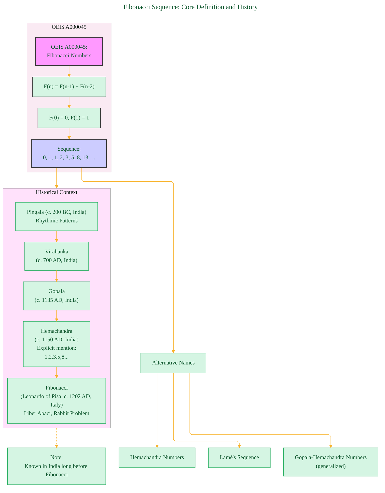
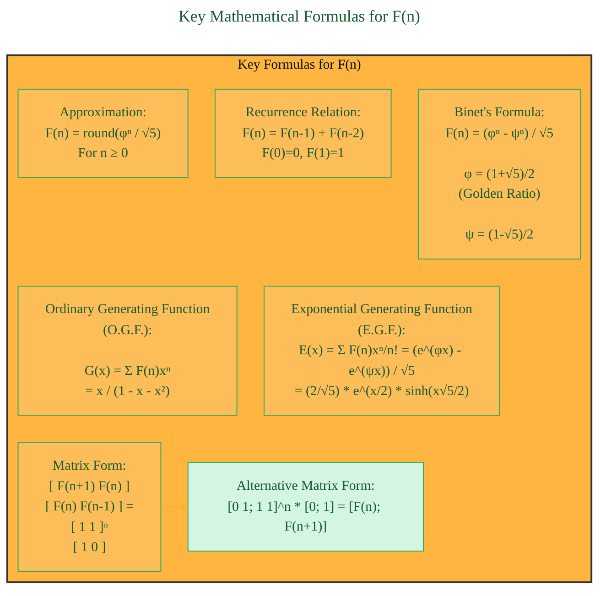
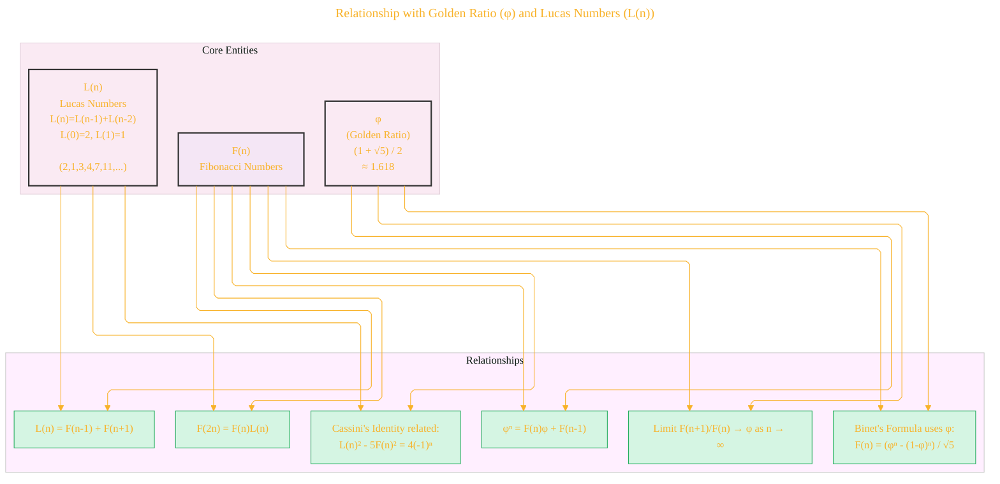
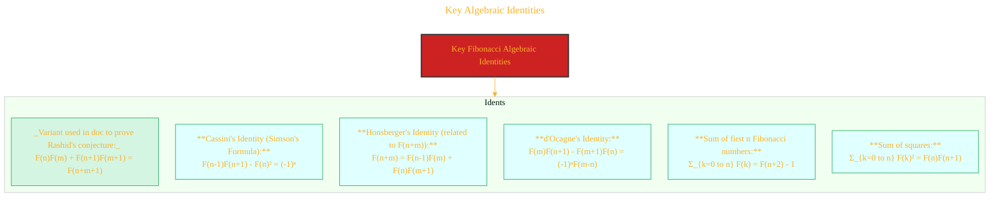
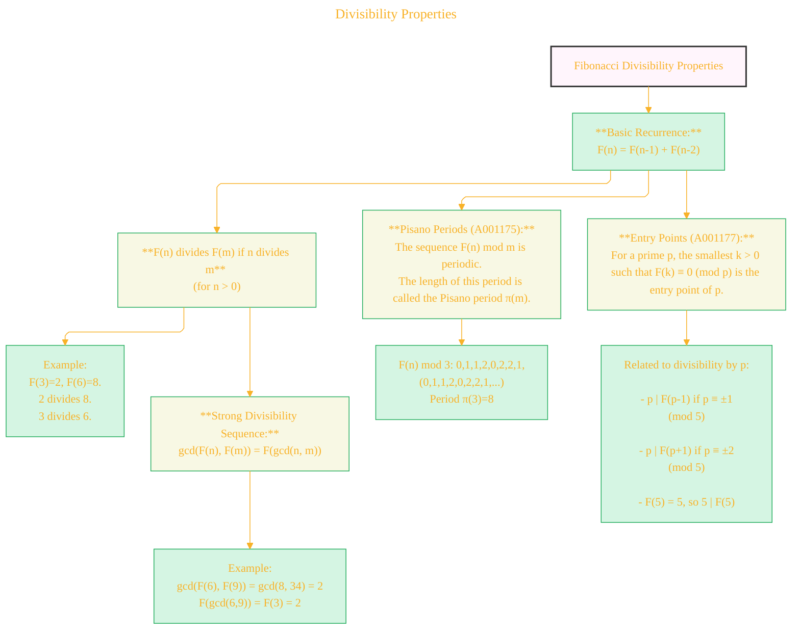
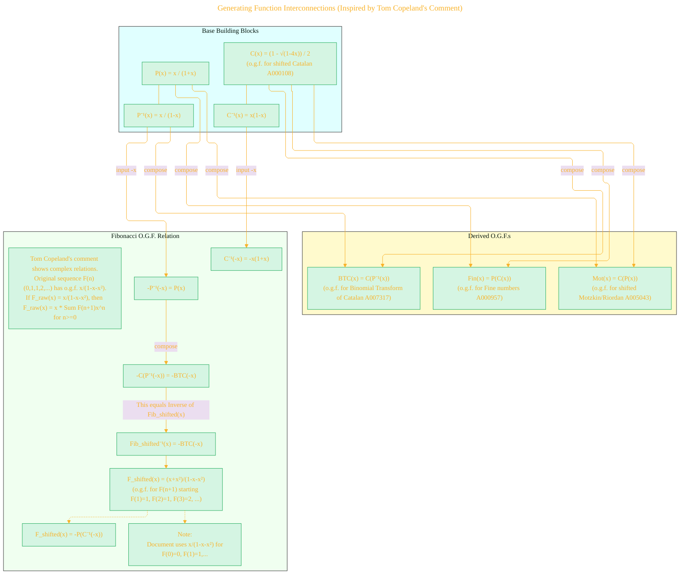
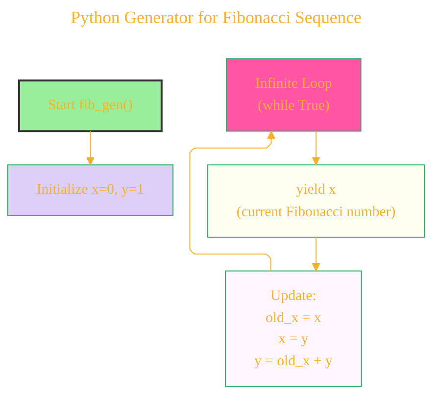

# Fibonacci Sequence (A000045) - A Diagrammatic Guide 
> **Disclaimer:**
>
> This document contains my personal notes on the topic,
> compiled from publicly available documentation and various cited sources.
> The materials are intended for educational purposes, personal study, and reference.
> The content is dual-licensed:
> 1. **MIT License:** Applies to all code implementations (Swift, Mermaid, and other programming languages).
> 2. **Creative Commons Attribution 4.0 International License (CC BY 4.0):** Applies to all non-code content, including text, explanations, diagrams, and illustrations.
---

## 1. Fibonacci Sequence: Core Definition and History

This diagram provides a basic introduction, the recurrence relation, initial terms, and a simplified historical timeline.

---

## 2. Key Mathematical Formulas for F(n)

This diagram highlights some of the fundamental explicit and approximate formulas for calculating Fibonacci numbers.

---

## 3. Sampler of Combinatorial Interpretations

Fibonacci numbers appear in a vast array of counting problems. This diagram shows a few common examples.

```mermaid
---
title: "Sampler of Combinatorial Interpretations"
author: "Cong Le"
version: "1.0"
license(s): "MIT, CC BY 4.0"
copyright: "Copyright (c) 2025 Cong Le. All Rights Reserved."
config:
  layout: elk
  theme: base
---
%%%%%%%% Mermaid version v11.4.1-b.14
%%%%%%%% Available curve styles include the following keywords:
%% basis, bumpX, bumpY, cardinal, catmullRom, linear, monotoneX, monotoneY, natural, step, stepAfter, stepBefore.
%%{
  init: {
    'flowchart': { 'htmlLabels': true, 'curve': 'linear' },
    'fontFamily': 'Monaco',
    'themeVariables': {
      'primaryColor': '#D5F5E3',
      'primaryTextColor': '#F8B229',
      'lineColor': '#F8B229',
      'primaryBorderColor': '#27AE60',
      'secondaryColor': '#EBDEF0',
      'secondaryTextColor': '#6C3483',
      'secondaryBorderColor': '#A569BD',
      'fontSize': '15px'
    }
  }
}%%
flowchart LR
    Root["Fibonacci Numbers Count..."] --> C1
    
    subgraph C1["F(n+2):<br/>Binary Sequences"]
    direction TB
        C1_Desc["Number of binary sequences of length n<br/>that have no consecutive 0's"]
        C1_Ex["n=3 (F(5)=5):<br/>111, 011, 101, 110, 010"]
    end

    Root --> C2
    subgraph C2["F(n+2):<br/>Subsets with No Consecutive Integers"]
    direction TB
        C2_Desc["Number of subsets of {1, 2, ..., n}<br/>that contain no consecutive integers"]
        C2_Ex["n=3 (F(5)=5):<br/>{}, {1}, {2}, {3}, {1,3}"]
    end

    Root --> C3
    subgraph C3["F(n+1):<br/> Domino Tilings"]
    direction TB
        C3_Desc["Number of ways to tile a 2 x n rectangle<br/>with 2 x 1 dominoes"]
        C3_Ex["n=3 (F(4)=3):<br/>III (all vertical)<br/>=II (1 horiz pair, 1 vert)<br/>II= (1 vert, 1 horiz pair)"]
        C3_Vis["Visually:<br/>[V V V]<br/>[H V]<br/>[V H]<br/>(H = horizontal pair)"]
         C3_Ex --> C3_Vis
    end

    Root --> C4
    subgraph C4 ["F(n):<br/>Compositions"]
    direction TB
        C4_DescA["F(n) = Number of compositions of n-1<br/>with no part greater than 2.<br/>(i.e., parts are only 1s and 2s)"]
        C4_ExA["n=4, F(4)=3, compositions of 3:<br/>1+1+1, 1+2, 2+1"]
        C4_DescB["F(n) = Number of compositions of n<br/>into odd parts"]
        C4_ExB["n=4, F(4)=3, compositions of 4:<br/>1+1+1+1, 1+3, 3+1"]
    end

    Root --> C5
    subgraph C5["F(n):<br/>Pascal's Triangle Diagonals"]
    direction TB
        C5_Desc["F(n) is the sum of entries on a 'shallow' diagonal<br/>in Pascal's triangle"]
        C5_Vis["Pascal's Triangle Snippet:<br/>      1<br/>     1 1<br/>    1 2 1<br/>   1 3 3 1<br/>  1 4 6 4 1<br/>F(1)=1 (1)<br/>F(2)=1 (1)<br/>F(3)=2 (1+1)<br/>F(4)=3 (1+2)<br/>F(5)=5 (1+3+1)<br/>_Sums along (binomial(n-k,k))_"]
    end

    style Root fill:#c22,stroke:#333,stroke-width:2px
    style C1 fill:#d4f8e8
    style C2 fill:#d4f8e8
    style C3 fill:#d4f8e8
    style C4 fill:#d4f8e8
    style C5 fill:#d4f8e8
    
```

---

## 4. Relationship with Golden Ratio (φ) and Lucas Numbers (L(n))

Fibonacci numbers are deeply intertwined with the Golden Ratio and Lucas numbers.

---

## 5. Key Algebraic Identities

This diagram illustrates some famous identities involving Fibonacci numbers.

---

## 6. Divisibility Properties

Fibonacci numbers exhibit interesting divisibility patterns.

---

## 7. Generating Function Interconnections (Inspired by Tom Copeland's Comment)

This diagram outlines how the ordinary generating function (o.g.f.) for Fibonacci numbers can be related to o.g.f.s of other important sequences like Catalan, Fine, and Motzkin numbers, through functional composition.

*Note: The Copeland's comment is quite dense. This diagram attempts to show the composition idea. The definition of "shifted" Fibonacci `FIBX_raw` here aims to match the structure that -P(Cinv(-x)) would yield, which starts with x. The standard F(n) g.f. `x/(1-x-x^2)` is F(0)x^0 + F(1)x^1 + F(2)x^2 ... = 0 + x + x^2 + 2x^3 + ...*

---

## 8. Python Generator for Fibonacci Sequence

Illustrating the logic of the provided Python code snippet `fib_gen`.

---
**Licenses:**

- **MIT License:**   - Full text in [LICENSE](LICENSE) file.
- **Creative Commons Attribution 4.0 International:**  - Legal details in [LICENSE-CC-BY](LICENSE-CC-BY) and at [Creative Commons official site](http://creativecommons.org/licenses/by/4.0/).

---