# Visualizing OEIS A000045 - Fibonacci Numbers - Draft

> **Source Attribution:**
>
> This document incorporates or adapts material from:
> - **The Online Encyclopedia of Integer Sequences** ([https://oeis.org/](https://oeis.org/))
> - Specific sequence: [OEIS A000045](https://oeis.org/A000045)
> - **© The OEIS Foundation Inc.**
>
> **License:**
> 
> - **OEIS-derived content** (any mathematical data, structure, text, or visuals based on OEIS): **CC BY-SA 4.0**
> - If you adapt/redistribute these portions, you **must** provide attribution as above and license your derivative work under the same terms.
> - **Original diagram source code** (e.g., Mermaid, PlantUML, or script syntax BY CONG LE, not including OEIS math/data): **MIT License**, unless otherwise stated.
> - If you reuse just the code itself for unrelated subjects, **MIT** applies.

---


Below is a comprehensive collection of diagrams and visual representations in Mermaid syntax, created to explain and structure the concepts, properties, formulas, combinatorial and algebraic aspects, programming representations, and history of the Fibonacci sequence as documented from [the original documentation](https://oeis.org/A000045).

---

## 1. The Fibonacci Sequence: Recurrence, Initial Values, and Closed Forms


---

## 2. Connections, Generalizations, and Historical Roots

### 2.1. Historical Timeline

```mermaid
---
title: "Fibonacci Numbers: Historical Milestones"
author: "Cong Le"
version: "1.0"
license(s): "MIT, CC BY-SA 4.0"
copyright: "Copyright (c) 2025 Cong Le. All Rights Reserved."
config:
  theme: base
---
%%%%%%%% Mermaid version v11.4.1-b.14
%%%%%%%% Available curve styles include the following keywords:
%% basis, bumpX, bumpY, cardinal, catmullRom, linear, monotoneX, monotoneY, natural, step, stepAfter, stepBefore.
%%{
  init: {
    'timeline': { 'htmlLabels': false},
    'fontFamily': 'Monaco',
    'themeVariables': {
      'primaryColor': '#D5F5E3',
      'primaryTextColor': '#145A32',
      'lineColor': '#F8B229',
      'primaryBorderColor': '#27AE60',
      'secondaryColor': '#EBDEF0',
      'secondaryTextColor': '#6C3483',
      'secondaryBorderColor': '#A569BD',
      'fontSize': '15px'
    }
  }
}%%
timeline
    title Fibonacci Numbers: Historical Milestones
    200 BC : Pingala (binary rhythm sequences)
    700 AD : Virahanka (India)
    1135-1150 : Gopāla, Hemachandra (India, combinatorial interpretations)
    1202 : Fibonacci (Italy, Liber Abaci - rabbit problem)
    1877 : Édouard Lucas names the Fibonacci sequence
    
```

### 2.2. Interrelated Sequences


---

## 3. Combinatorial Interpretations


---

## 4. Algebraic and Analytical Properties

### 4.1. Golden Ratio and Convergents

```mermaid
---
title: "Golden Ratio and Convergents"
author: "Cong Le"
version: "1.0"
license(s): "MIT, CC BY-SA 4.0"
copyright: "Copyright (c) 2025 Cong Le. All Rights Reserved."
config:
  layout: elk
  theme: base
---
%%%%%%%% Mermaid version v11.4.1-b.14
%%%%%%%% Available curve styles include the following keywords:
%% basis, bumpX, bumpY, cardinal, catmullRom, linear, monotoneX, monotoneY, natural, step, stepAfter, stepBefore.
%%{
  init: {
    'flowchart': { 'htmlLabels': true, 'curve': 'linear' },
    'fontFamily': 'Monaco',
    'themeVariables': {
      'primaryColor': '#D5F5E3',
      'primaryTextColor': '#F8B229',
      'lineColor': '#F8B229',
      'primaryBorderColor': '#27AE60',
      'secondaryColor': '#EBDEF0',
      'secondaryTextColor': '#6C3483',
      'secondaryBorderColor': '#A569BD',
      'fontSize': '15px'
    }
  }
}%%
flowchart LR
    A["F(n+1)/F(n)"]
    -->|"n→∞"| B["Converges to <br/>φ ≈ 1.618..."]
    B -->|"Continued Fraction"| C["φ = [1; 1, 1, 1, ...]"]
    B -->|"Farey Fractions"| D["F(n+1)/F(n) <br/>also as Farey convergents"]
    
```

### 4.2. Matrix Formulation

```mermaid
---
title: "Matrix Formulation"
author: "Cong Le"
version: "1.0"
license(s): "MIT, CC BY-SA 4.0"
copyright: "Copyright (c) 2025 Cong Le. All Rights Reserved."
config:
  layout: elk
  theme: base
---
%%%%%%%% Mermaid version v11.4.1-b.14
%%%%%%%% Available curve styles include the following keywords:
%% basis, bumpX, bumpY, cardinal, catmullRom, linear, monotoneX, monotoneY, natural, step, stepAfter, stepBefore.
%%{
  init: {
    'flowchart': { 'htmlLabels': true, 'curve': 'linear' },
    'fontFamily': 'Monaco',
    'themeVariables': {
      'primaryColor': '#D5F5E3',
      'primaryTextColor': '#F8B229',
      'lineColor': '#F8B229',
      'primaryBorderColor': '#27AE60',
      'secondaryColor': '#EBDEF0',
      'secondaryTextColor': '#6C3483',
      'secondaryBorderColor': '#A569BD',
      'fontSize': '15px'
    }
  }
}%%
flowchart LR
    Start_Matrix["𝑀 = [[0,1],[1,1]]"]
    Start_Matrix -->|"M^n * [0;1]"| B["[F(n); F(n+1)]"]
    
```

### 4.3. Divisibility and Sequence Laws


---

## 5. Identites & Famous Formulas

### 5.1. Summation, Binomial, and Catalan Connections

```mermaid
---
title: "Summation, Binomial, and Catalan Connections"
author: "Cong Le"
version: "1.0"
license(s): "MIT, CC BY-SA 4.0"
copyright: "Copyright (c) 2025 Cong Le. All Rights Reserved."
config:
  layout: elk
  theme: base
---
%%%%%%%% Mermaid version v11.4.1-b.14
%%%%%%%% Available curve styles include the following keywords:
%% basis, bumpX, bumpY, cardinal, catmullRom, linear, monotoneX, monotoneY, natural, step, stepAfter, stepBefore.
%%{
  init: {
    'flowchart': { 'htmlLabels': true, 'curve': 'linear' },
    'fontFamily': 'Monaco',
    'themeVariables': {
      'primaryColor': '#D5F5E3',
      'primaryTextColor': '#F8B229',
      'lineColor': '#F8B229',
      'primaryBorderColor': '#27AE60',
      'secondaryColor': '#EBDEF0',
      'secondaryTextColor': '#6C3483',
      'secondaryBorderColor': '#A569BD',
      'fontSize': '15px'
    }
  }
}%%
flowchart TD
    A["F(n+1) = Σ_{j=0}^{floor(n/2)} binom(n-j, j)"]
    B["F(n+2) = Σ_{k=0}^{n} binom(floor((n+k)/2), k)"]
    C["F(n) = row sums in 45-degree diagonals of Pascal's triangle"]
    D["Fibonacci in Pascal,<br/> Catalan sequences"]
    
    A & B & C --> D
    
```

### 5.2. Recurrences and Higher Order Relations

```mermaid
---
title: "Recurrences and Higher Order Relations"
author: "Cong Le"
version: "1.0"
license(s): "MIT, CC BY-SA 4.0"
copyright: "Copyright (c) 2025 Cong Le. All Rights Reserved."
config:
  layout: elk
  theme: base
---
%%%%%%%% Mermaid version v11.4.1-b.14
%%%%%%%% Available curve styles include the following keywords:
%% basis, bumpX, bumpY, cardinal, catmullRom, linear, monotoneX, monotoneY, natural, step, stepAfter, stepBefore.
%%{
  init: {
    'flowchart': { 'htmlLabels': true, 'curve': 'linear' },
    'fontFamily': 'Monaco',
    'themeVariables': {
      'primaryColor': '#D5F5E3',
      'primaryTextColor': '#F8B229',
      'lineColor': '#F8B229',
      'primaryBorderColor': '#27AE60',
      'secondaryColor': '#EBDEF0',
      'secondaryTextColor': '#6C3483',
      'secondaryBorderColor': '#A569BD',
      'fontSize': '15px'
    }
  }
}%%
flowchart TD
    A["F(n) = F(n-1) + F(n-2)"]
    B["F(n) <br/>= 4 F(n-3) + F(n-6),<br/> n ≥ 6"]
    C["F(n) <br/>= 2F(n-2) + F(n-3),<br/> n > 2"]
    D["F(n) = (-1)^{n}F(-n)"]
    E["Generalized k-order recurrences"]
    A --"extensions"--> B
    A --"other forms"--> C
    
    A -.-> E
    B -.-> E
    C -.-> E
    
```

### 5.3. Famous Identities

```mermaid
---
title: "Famous Identities"
author: "Cong Le"
version: "1.0"
license(s): "MIT, CC BY-SA 4.0"
copyright: "Copyright (c) 2025 Cong Le. All Rights Reserved."
config:
  layout: elk
  theme: base
---
%%%%%%%% Mermaid version v11.4.1-b.14
%%%%%%%% Available curve styles include the following keywords:
%% basis, bumpX, bumpY, cardinal, catmullRom, linear, monotoneX, monotoneY, natural, step, stepAfter, stepBefore.
%%{
  init: {
    'flowchart': { 'htmlLabels': true, 'curve': 'linear' },
    'fontFamily': 'Monaco',
    'themeVariables': {
      'primaryColor': '#D5F5E3',
      'primaryTextColor': '#F8B229',
      'lineColor': '#F8B229',
      'primaryBorderColor': '#27AE60',
      'secondaryColor': '#EBDEF0',
      'secondaryTextColor': '#6C3483',
      'secondaryBorderColor': '#A569BD',
      'fontSize': '15px'
    }
  }
}%%
flowchart TD
    A["Cassini's:<br/> F(n-1)*F(n+1)-F(n)^2 <br/>= (-1)^n"]
    B["Catalan's:<br/> F(n)^2 - F(n+k)*F(n-k) <br/>= (-1)^{n+k} F(k)^2"]
    C["d'Ocagne’s:<br/> F(n)*F(m+1)-F(n+1)*F(m)<br/>= (-1)^m F(n-m)"]
    D["L(n):<br/> Lucas numbers"]
    
    A --"→"--> D
    B --"→"--> D
    C --"→"--> D
    
```

---

## 6. Relationships to Other Sequences

```mermaid
---
title: "Relationships to Other Sequences"
author: "Cong Le"
version: "1.0"
license(s): "MIT, CC BY-SA 4.0"
copyright: "Copyright (c) 2025 Cong Le. All Rights Reserved."
config:
  layout: elk
  theme: base
---
%%%%%%%% Mermaid version v11.4.1-b.14
%%%%%%%% Available curve styles include the following keywords:
%% basis, bumpX, bumpY, cardinal, catmullRom, linear, monotoneX, monotoneY, natural, step, stepAfter, stepBefore.
%%{
  init: {
    'flowchart': { 'htmlLabels': true, 'curve': 'linear' },
    'fontFamily': 'Monaco',
    'themeVariables': {
      'primaryColor': '#D5F5E3',
      'primaryTextColor': '#F8B229',
      'lineColor': '#F8B229',
      'primaryBorderColor': '#27AE60',
      'secondaryColor': '#EBDEF0',
      'secondaryTextColor': '#6C3483',
      'secondaryBorderColor': '#A569BD',
      'fontSize': '15px'
    }
  }
}%%
flowchart TD
    A["Fibonacci<br/>(A000045)"]
    A -->|"Lucas Recurrence"| B["Lucas<br/>(A000032)"]
    A -->|"Even indices"| C["A001906:<br/> F(2n)"]
    A -->|"Pisano Period"| D["A001175:<br/> Fibonacci mod n"]
    A -->|"Entry point"| E["A001177"]
    A -->|"Generalized k-step Fib"| F["A000930, A003269"]
    A -->|"Pell Numbers by INVERT"| G["A000129"]
    A -->|"Narayana’s cows"| H["A000930"]
    
```

---

## 7. Fibonacci in Graphs, Lattices & Tiling


---

## 8. Programming and Algorithmic Representations

### 8.1. Various Implementations

```mermaid
---
title: "Various Implementations"
author: "Cong Le"
version: "1.0"
license(s): "MIT, CC BY-SA 4.0"
copyright: "Copyright (c) 2025 Cong Le. All Rights Reserved."
config:
  layout: elk
  theme: base
---
%%%%%%%% Mermaid version v11.4.1-b.14
%%%%%%%% Available curve styles include the following keywords:
%% basis, bumpX, bumpY, cardinal, catmullRom, linear, monotoneX, monotoneY, natural, step, stepAfter, stepBefore.
%%{
  init: {
    'flowchart': { 'htmlLabels': true, 'curve': 'linear' },
    'fontFamily': 'Monaco',
    'themeVariables': {
      'primaryColor': '#D5F5E3',
      'primaryTextColor': '#F8B229',
      'lineColor': '#F8B229',
      'primaryBorderColor': '#27AE60',
      'secondaryColor': '#EBDEF0',
      'secondaryTextColor': '#6C3483',
      'secondaryBorderColor': '#A569BD',
      'fontSize': '15px'
    }
  }
}%%
flowchart LR
    R["Recursion"] -->|"Naive O(2^n)"| R1["def fib(n):<br/>  if n < 2: return n<br/>  return fib(n-1) + fib(n-2)"]
    M["Matrix Powers"] -->|"O(log n)"| M1["F(n) = (M^n)[0,1]"]
    I["Iterative"] -->|"O(n)"| I1["for i in range(2,n):<br/> a[i]=a[i-1]+a[i-2]"]
    F["Fast Doubling"] -->|"O(log n)"| F1["def fib(n):<br/> ... <br/>(see Project Nayuki)"]
    L["Closed Form"] -->|"on floats"| L1["F(n) = round(φ^n/√5)"]
    
```

---

## 9. Generating Functions

```mermaid
---
title: "Generating Functions"
author: "Cong Le"
version: "1.0"
license(s): "MIT, CC BY-SA 4.0"
copyright: "Copyright (c) 2025 Cong Le. All Rights Reserved."
config:
  layout: elk
  theme: base
---
%%%%%%%% Mermaid version v11.4.1-b.14
%%%%%%%% Available curve styles include the following keywords:
%% basis, bumpX, bumpY, cardinal, catmullRom, linear, monotoneX, monotoneY, natural, step, stepAfter, stepBefore.
%%{
  init: {
    'flowchart': { 'htmlLabels': true, 'curve': 'linear' },
    'fontFamily': 'Monaco',
    'themeVariables': {
      'primaryColor': '#D5F5E3',
      'primaryTextColor': '#F8B229',
      'lineColor': '#F8B229',
      'primaryBorderColor': '#27AE60',
      'secondaryColor': '#EBDEF0',
      'secondaryTextColor': '#6C3483',
      'secondaryBorderColor': '#A569BD',
      'fontSize': '15px'
    }
  }
}%%
flowchart LR
    G["Ordinary Generating Function"]
    G1["F(x) <br/>= x / (1 - x - x^2)"]
    E["Exponential Generating Function"]
    E1["(2/√5) * exp(x/2) * sinh(√5 * x / 2)"]
    G --"(g.f.)"--> G1
    E --"(e.g.f.)"--> E1
    
```

---

## 10. Other Advanced Properties & Symmetries


---

## 11. Notable Applications and Real World

```mermaid
---
title: "Notable Applications and Real World"
author: "Cong Le"
version: "1.0"
license(s): "MIT, CC BY-SA 4.0"
copyright: "Copyright (c) 2025 Cong Le. All Rights Reserved."
config:
  layout: elk
  theme: base
---
%%%%%%%% Mermaid version v11.4.1-b.14
%%%%%%%% Available curve styles include the following keywords:
%% basis, bumpX, bumpY, cardinal, catmullRom, linear, monotoneX, monotoneY, natural, step, stepAfter, stepBefore.
%%{
  init: {
    'journey': { 'htmlLabels': true},
    'fontFamily': 'Monaco',
    'themeVariables': {
      'primaryColor': '#D5F5E3',
      'primaryTextColor': '#F8B229',
      'lineColor': '#F8B229',
      'primaryBorderColor': '#27AE60',
      'secondaryColor': '#EBDEF0',
      'secondaryTextColor': '#6C3483',
      'secondaryBorderColor': '#A569BD',
      'fontSize': '15px'
    }
  }
}%%
journey
    title Fibonacci Numbers: Applications Journey
    
    section Nature
      Phyllotaxis (flowers, leaves): 5: 👁️
      Pinecones, Sunflowers: 5: 👁️
    
    section Computer Science
      Search Algorithms (Fibonacci Search): 4: 👨‍💻
      Data Structures (heap, graph matchings): 4: 👨‍💻
    
    section Combinatorics
      Tiling, Matchings, Binary Strings: 5: 📊
    
    section Chemistry
      Kekulé structures in benzene/polyphenanthrenes: 3: 🧪
    
    section Physics and Math
      Random walks, tridiagonal matrices: 5: 🔢
      
```

---

## 12. OEIS Page Structure (Meta)


---

## 13. Depth of Mathematical Structure

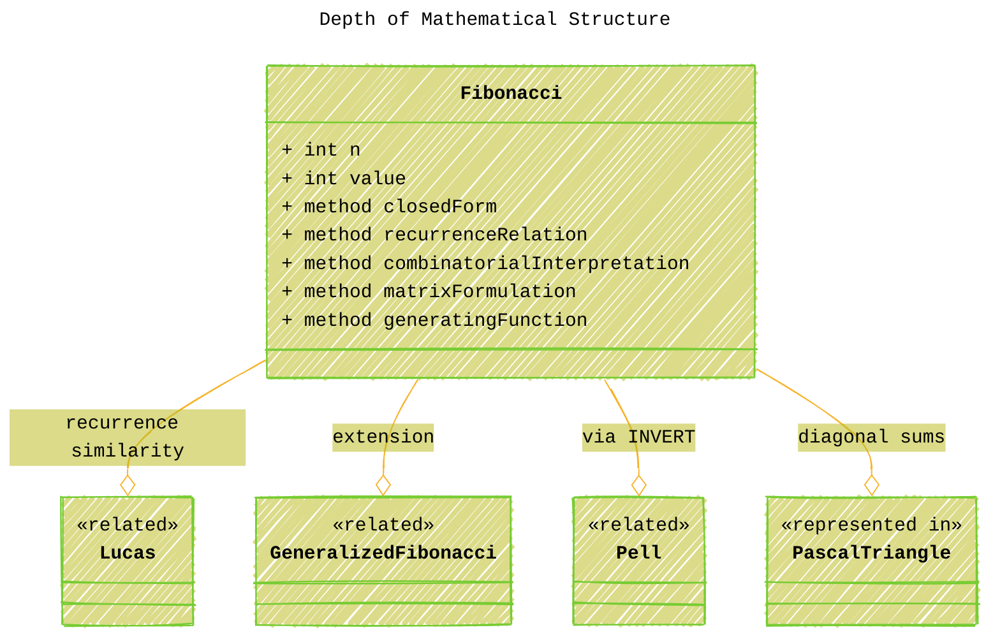


---

## 14. Prime/Divisibility Structure


---

## 15. Summary Mindmap: "Fibonacci Numbers in OEIS A000045"


---

## 16. Connections to OEIS and Related Indexes

```mermaid
---
title: "Connections to OEIS and Related Indexes"
author: "Cong Le"
version: "1.0"
license(s): "MIT, CC BY-SA 4.0"
copyright: "Copyright (c) 2025 Cong Le. All Rights Reserved."
config:
  layout: elk
  theme: base
---
%%%%%%%% Mermaid version v11.4.1-b.14
%%%%%%%% Available curve styles include the following keywords:
%% basis, bumpX, bumpY, cardinal, catmullRom, linear, monotoneX, monotoneY, natural, step, stepAfter, stepBefore.
%%{
  init: {
    'flowchart': { 'htmlLabels': true, 'curve': 'linear' },
    'fontFamily': 'Monaco',
    'themeVariables': {
      'primaryColor': '#D5F5E3',
      'primaryTextColor': '#F8B229',
      'lineColor': '#F8B229',
      'primaryBorderColor': '#27AE60',
      'secondaryColor': '#EBDEF0',
      'secondaryTextColor': '#6C3483',
      'secondaryBorderColor': '#A569BD',
      'fontSize': '15px'
    }
  }
}%%
flowchart TD
    A000045["Fibonacci"]
        -->|"Pisano Periods"| A001175
        -->|"Entry Points"| A001177
        -->|"k-Generalized"| A092921
        -->|"Prime Factors<br/>(Distinct)"| A022307
        -->|"Prime Factors<br/>(Multiplicity)"| A038575
        -->|"Even Indices"| A001906
        -->|"Lucas Numbers"| A000032
        -->|"Pell Numbers"| A000129
        
```

---

# Legend

- **Rectangles/Nodes:** Concepts, properties, formulas, or objects.
- **Arrows:** "Yields", "is connected to", "interpreted as", or "can be mapped to".
- **Dashed/Light Lines:** Indicate generalizations or extensions.
- **Mindmap:** Shows the immense breadth and cross-connections of the Fibonacci sequence as revealed in A000045.


---

> **License and Attribution**
> - Mathematical data and exposition adapted from **The Online Encyclopedia of Integer Sequences** (<https://oeis.org/>), [OEIS sequence A000045](https://oeis.org/A000045), © OEIS Foundation Inc., licensed under [CC BY-SA 4.0](https://creativecommons.org/licenses/by-sa/4.0/) [](https://creativecommons.org/licenses/by-sa/4.0/).
> - Legal details in [LICENSE-CC-BY-SA-4.0](LICENSE-CC-BY-SA-4.0) and at [Creative Commons official site](https://creativecommons.org/licenses/by-sa/4.0/).
> - Diagram and explanatory code © 2025 Cong Le, **MIT License** [](LICENSE) (for code **only**)- Full text in [LICENSE](LICENSE) file.
> - If you adapt, redistribute, or make derivative works involving *OEIS-based content*, you must retain this notice and apply **CC BY-SA 4.0**.

---