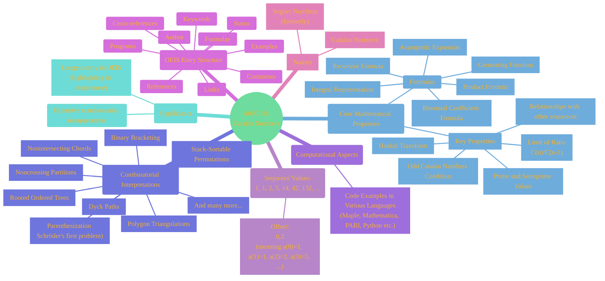
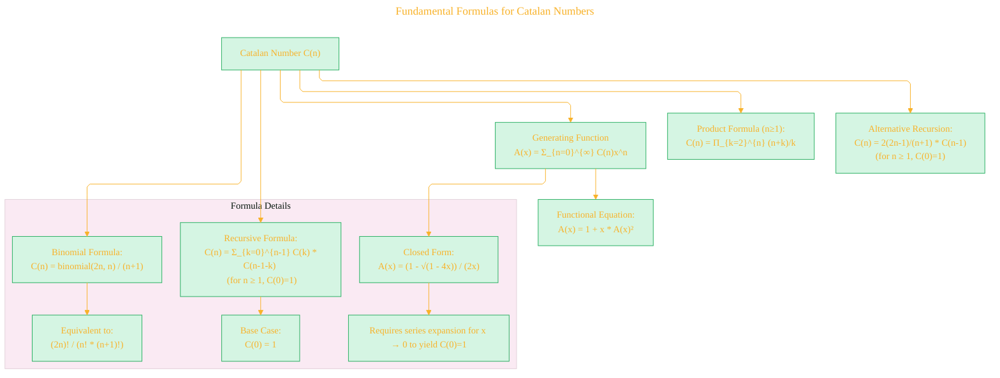
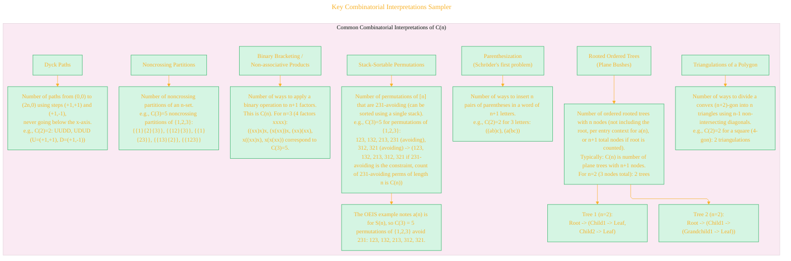
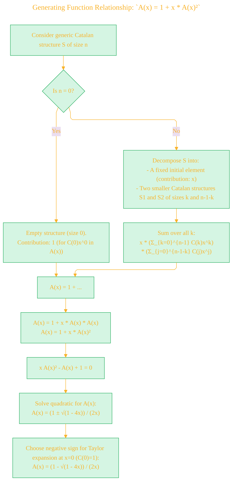
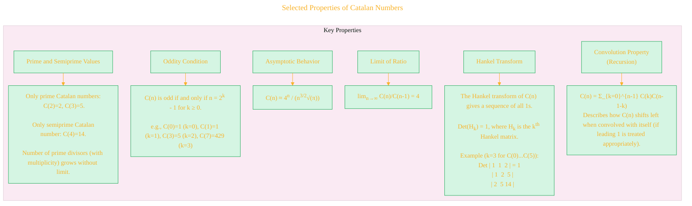
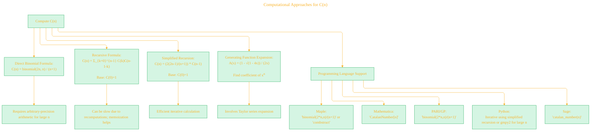
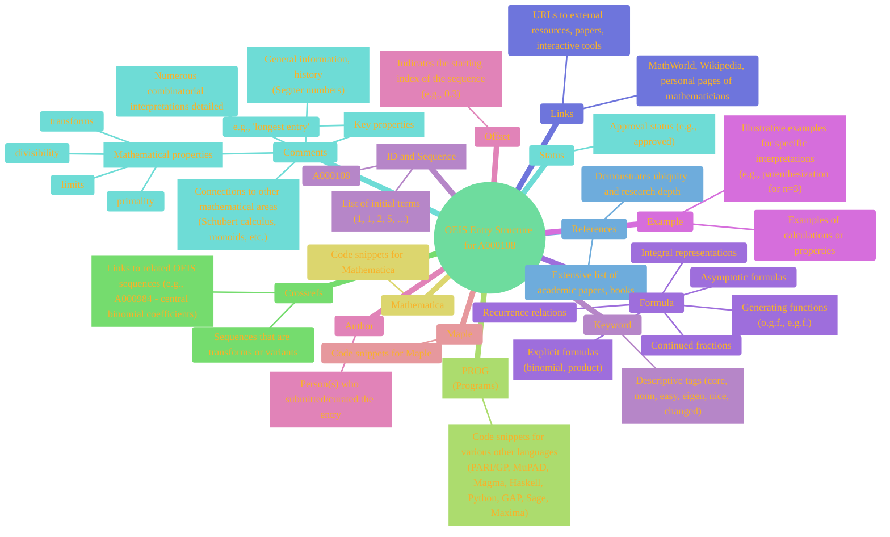

# Visualizing OEIS A000108 - Catalan Numbers - Draft

> **Source Attribution:**
>
> This document incorporates or adapts material from:
> - **The Online Encyclopedia of Integer Sequences** ([https://oeis.org/](https://oeis.org/))
> - Specific sequence: [OEIS A000108](https://oeis.org/A000108)
> - **© The OEIS Foundation Inc.**
>
> **License:**
> 
> - **OEIS-derived content** (any mathematical data, structure, text, or visuals based on OEIS): **CC BY-SA 4.0**
> - If you adapt/redistribute these portions, you **must** provide attribution as above and license your derivative work under the same terms.
> - **Original diagram source code** (e.g., Mermaid, PlantUML, or script syntax BY CONG LE, not including OEIS math/data): **MIT License**, unless otherwise stated.
> - If you reuse just the code itself for unrelated subjects, **MIT** applies.

----

The On-Line Encyclopedia of Integer Sequences (OEIS) entry A000108 describes the Catalan numbers. This document provides a comprehensive overview of this fascinating sequence. Below are diagrams illustrating its various facets.

## 1. Overview of Catalan Numbers (A000108)

This mind map provides a high-level overview of the topics covered in the OEIS entry for Catalan numbers.

---

## 2. Fundamental Formulas for Catalan Numbers

The Catalan numbers, C(n) or a(n) in the OEIS entry, can be defined and calculated through several fundamental formulas.

---

## 3. Key Combinatorial Interpretations Sampler

Catalan numbers appear as the solution to a vast array of counting problems. Here are a few prominent examples:

---

## 4. Generating Function Relationship: `A(x) = 1 + x * A(x)²`

The recursive nature of many Catalan structures leads directly to the functional equation for its ordinary generating function (o.g.f.).

---

## 5. Selected Properties of Catalan Numbers

Catalan numbers possess many interesting mathematical properties.

----

## 6. Computational Approaches for C(n)

There are several ways to compute Catalan numbers.

---

## 7. OEIS Entry Structure (A000108 Example)

The OEIS entry for A000108 is extensive and follows a standard structure, which is typical for many well-documented sequences.

---

> **License and Attribution**
> - Mathematical data and exposition adapted from **The Online Encyclopedia of Integer Sequences** (<https://oeis.org/>), [OEIS sequence A000108](https://oeis.org/A000108), © OEIS Foundation Inc., licensed under [CC BY-SA 4.0](https://creativecommons.org/licenses/by-sa/4.0/) .
> - Legal details in [LICENSE-CC-BY-SA-4.0](LICENSE-CC-BY-SA-4.0) and at [Creative Commons official site](https://creativecommons.org/licenses/by-sa/4.0/).
> - Diagram and explanatory code © 2025 Cong Le, **MIT License**  (for code **only**)- Full text in [LICENSE](LICENSE) file.
> - If you adapt, redistribute, or make derivative works involving *OEIS-based content*, you must retain this notice and apply **CC BY-SA 4.0**.

---

