# Visualizing OEIS A000108 - Catalan Numbers - Draft

> **Source Attribution:**
>
> This document incorporates or adapts material from:
> - **The Online Encyclopedia of Integer Sequences** ([https://oeis.org/](https://oeis.org/))
> - Specific sequence: [OEIS A000108](https://oeis.org/A000108)
> - © The OEIS Foundation Inc.
>
> **License:**
> 
> - **OEIS-derived content** (any mathematical data, structure, text, or visuals based on OEIS): **CC BY-SA 4.0**
> - If you adapt/redistribute these portions, you **must** provide attribution as above and license your derivative work under the same terms.
> - **Original diagram source code** (e.g., Mermaid, PlantUML, or script syntax BY CONG LE, not including OEIS math/data): **MIT License**, unless otherwise stated.
> - If you reuse just the code itself for unrelated subjects, **MIT** applies.

Below is a collection of *strategically designed Mermaid diagrams* elaborating the core structures, recurrences, combinatorial interpretations, formulas, and the rich mathematical framework of the **Catalan numbers** as distilled from [the original documentation](https://oeis.org/A000108).

---

## 1. Catalan Number Sequence and Fundamental Formulae

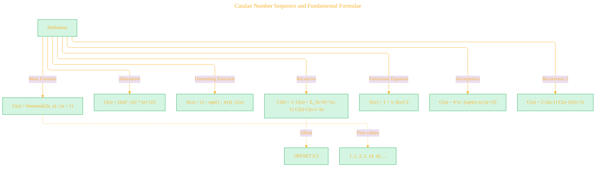

---

## 2. Tree of Major Combinatorial Interpretations

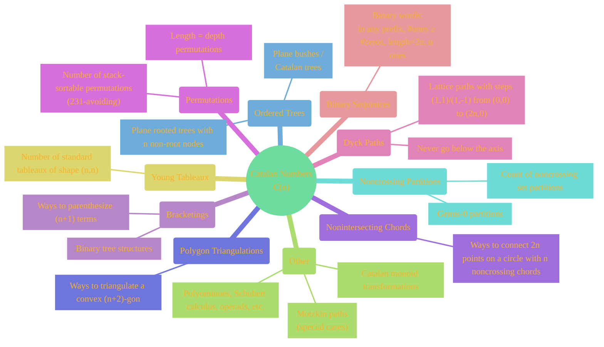

---

## 3. Core Recursion and Self-Convolution

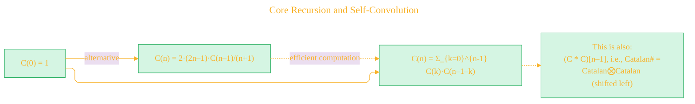

---

## 4. Generating Functions and Continued Fractions

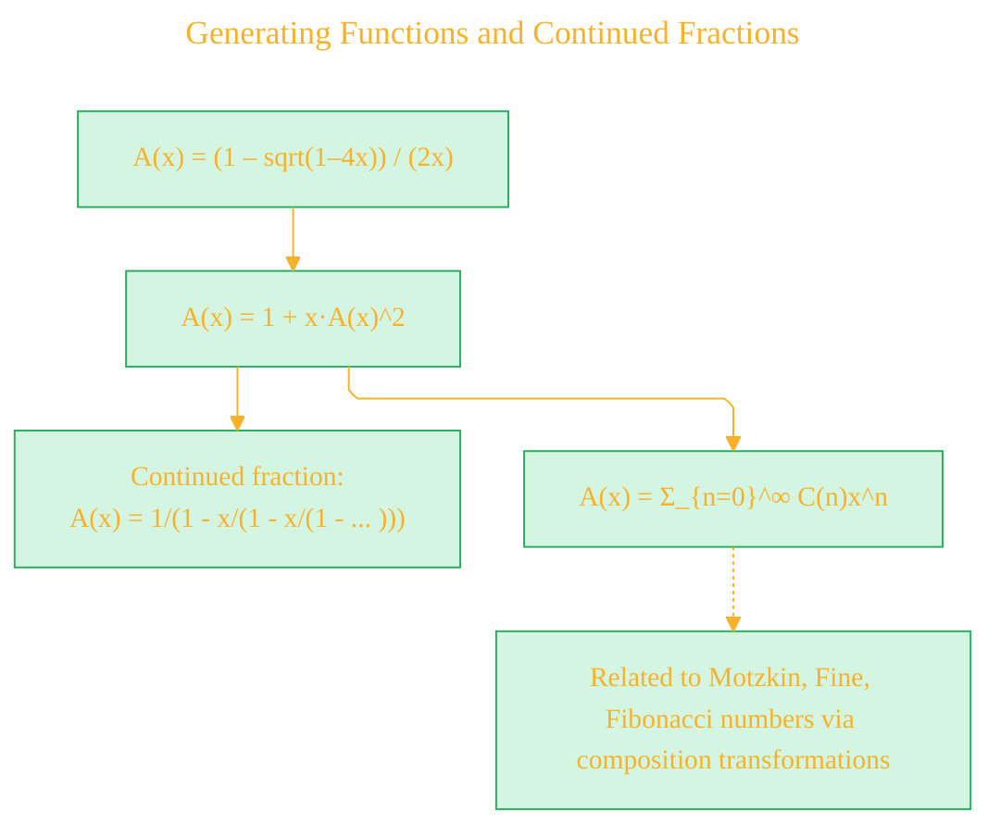

---

## 5. Many Faces of Catalan (Object Mappings)

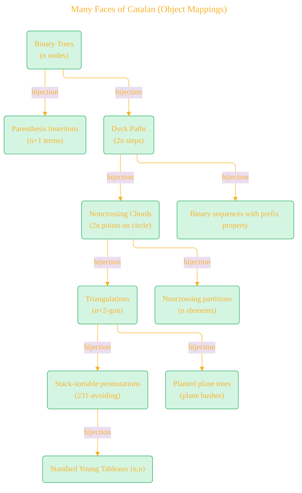

---

## 6. Algorithmic Formulas Collage

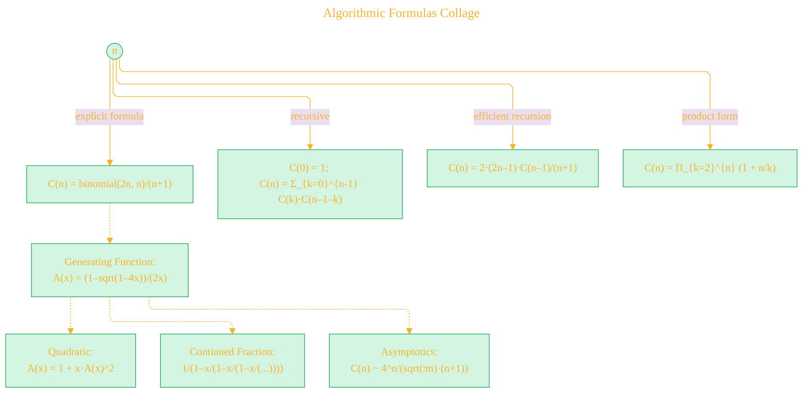

---

## 7. Lattice Paths: Interpretation of Dyck Paths

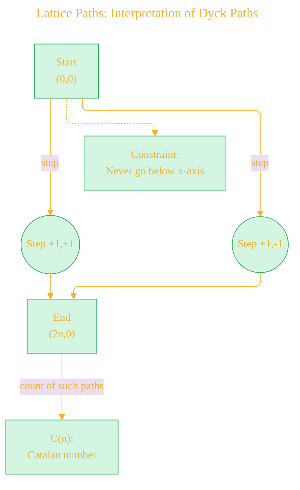

---

## 8. Tree of Notable Properties and Further Connections

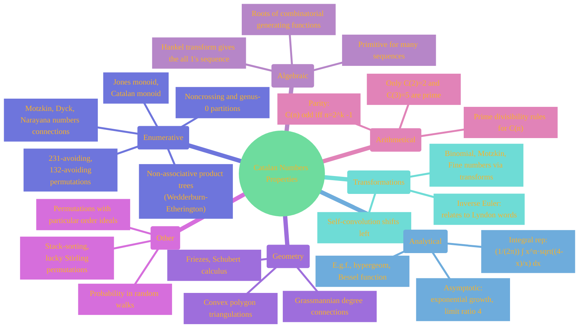

---

## 9. Formulas and Generating Function Interrelationships

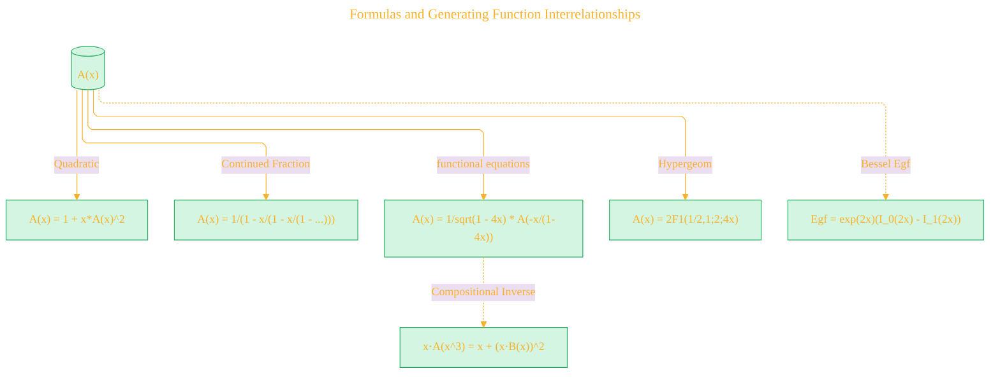

---

## 10. Meta-Structure: Catalan in Research and Mathematics

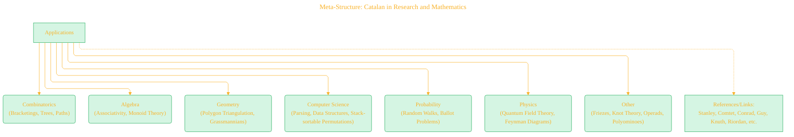

---

## 11. Timeline & Name Origin

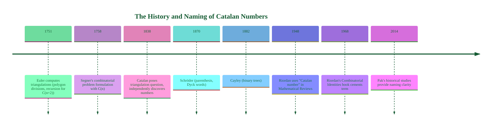

---

## 12. Asymptotics, Limits, and Growth

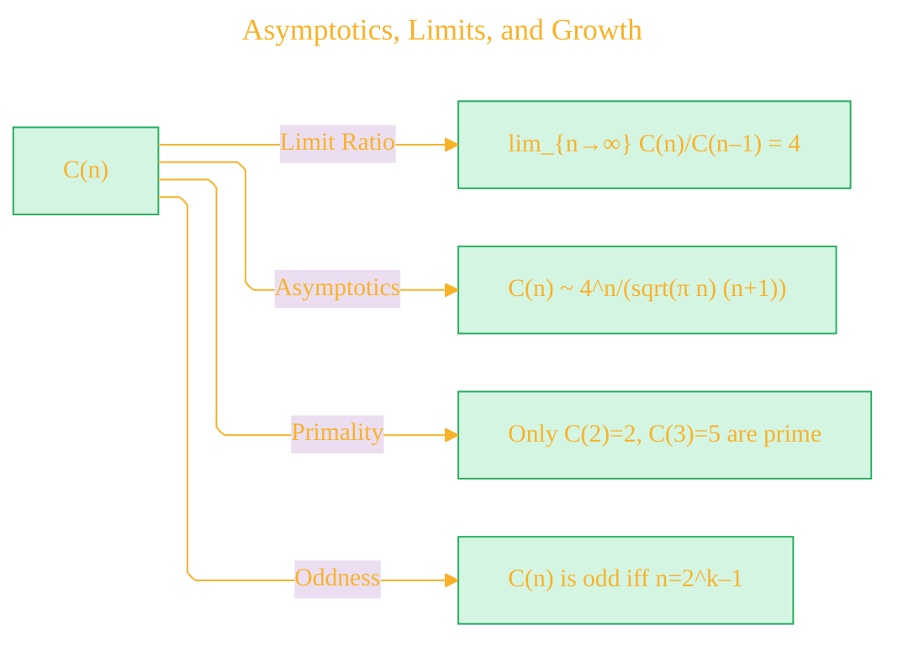

---

## 13. Algorithm Implementations (Overview)

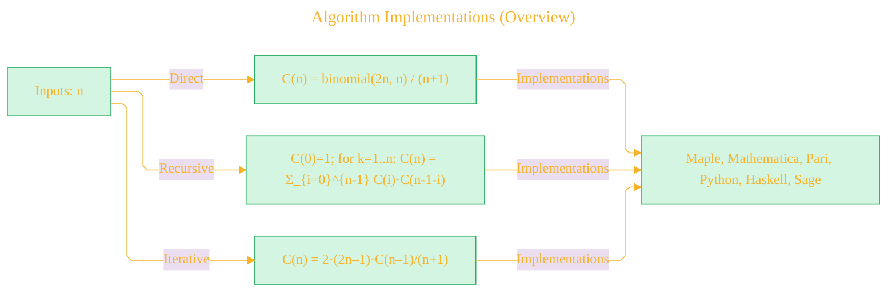

---

## 14. Catalan in the "Universe" of OEIS and Cross-References

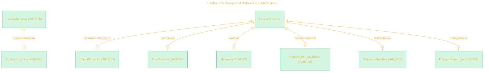

---

## 15. "Catalan Number World" (Summary Mindmap)

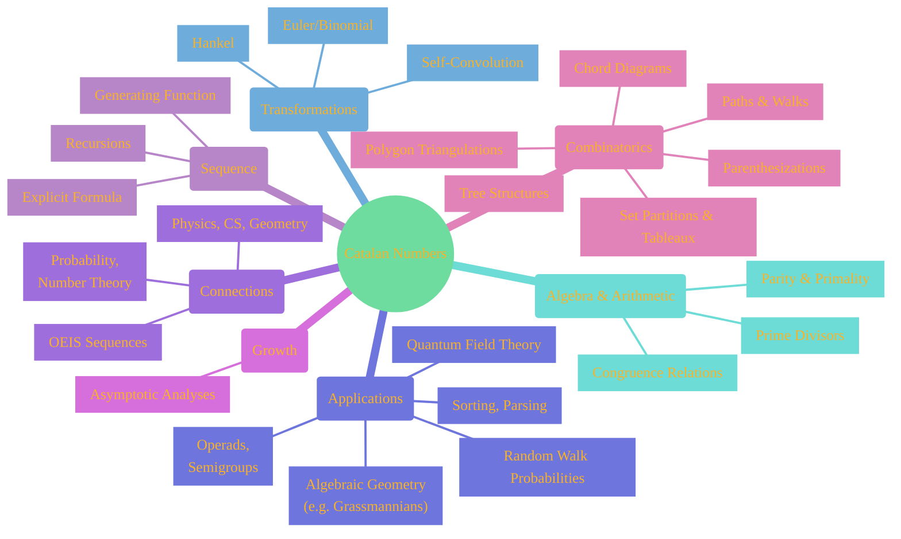

---

By connecting recursive, enumerative, algebraic, and analytic frameworks, these diagrams collectively showcase the **beauty, ubiquity, and depth of the Catalan numbers**—linking explicit formulas, tree and path interpretations, partition lattice structure, transformations, and real-world mathematical applications.

---

> **License and Attribution**
> - Mathematical data and exposition adapted from **The Online Encyclopedia of Integer Sequences** (<https://oeis.org/>), [OEIS sequence A000108](https://oeis.org/A000108), © OEIS Foundation Inc., licensed under [CC BY-SA 4.0](https://creativecommons.org/licenses/by-sa/4.0/) .
> - Legal details in [LICENSE-CC-BY-SA-4.0](LICENSE-CC-BY-SA-4.0) and at [Creative Commons official site](https://creativecommons.org/licenses/by-sa/4.0/).
> - Diagram and explanatory code © 2025 Cong Le, **MIT License**  (for code **only**)- Full text in [LICENSE](LICENSE) file.
> - If you adapt, redistribute, or make derivative works involving *OEIS-based content*, you must retain this notice and apply **CC BY-SA 4.0**.

---

