> **Source Attribution:**
>
> This document incorporates or adapts material from:
> - **The Online Encyclopedia of Integer Sequences** ([https://oeis.org/](https://oeis.org/))
> - Specific sequence: [OEIS A000292](https://oeis.org/A000292)
> - © The OEIS Foundation Inc.
>
> **License:**
> 
> - **OEIS-derived content** (any mathematical data, structure, text, or visuals based on OEIS): **CC BY-SA 4.0**
> - If you adapt/redistribute these portions, you **must** provide attribution as above and license your derivative work under the same terms.
> - **Original diagram source code** (e.g., Mermaid, PlantUML, or script syntax BY CONG LE, not including OEIS math/data): **MIT License**, unless otherwise stated.
> - If you reuse just the code itself for unrelated subjects, **MIT** applies.


# Visualizing OEIS A000292 - The Tetrahedral Numbers - Draft


The following collection of **Mermaid diagrams** comprehensively illustrates the core mathematical, combinatorial, geometric, and algebraic concepts in the extensive documentation for [OEIS A000292 (Tetrahedral Numbers)](https://oeis.org/A000292).

---

## 1. Definition and Formulae

### a. Binomial and Closed Formula

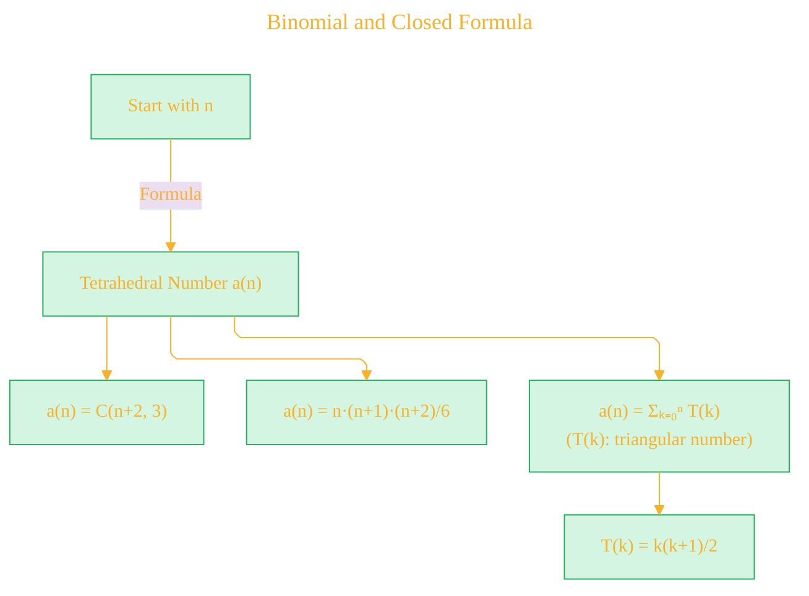

### b. Generating Function

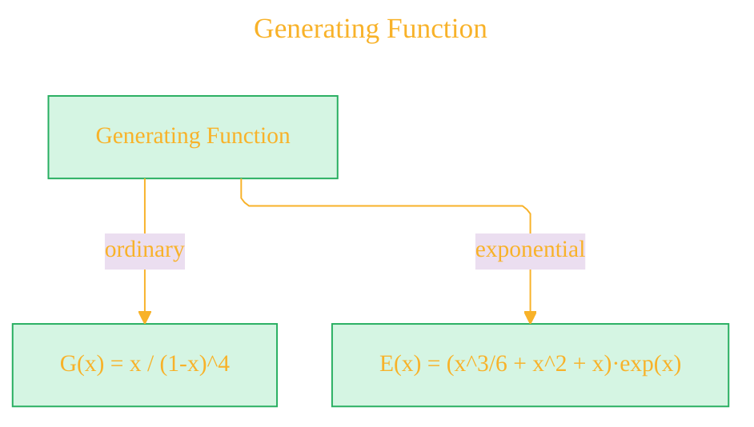


---

## 2. Visual Interpretations

### a. Triangular Pyramid (“Stacking Balls”) Visualization

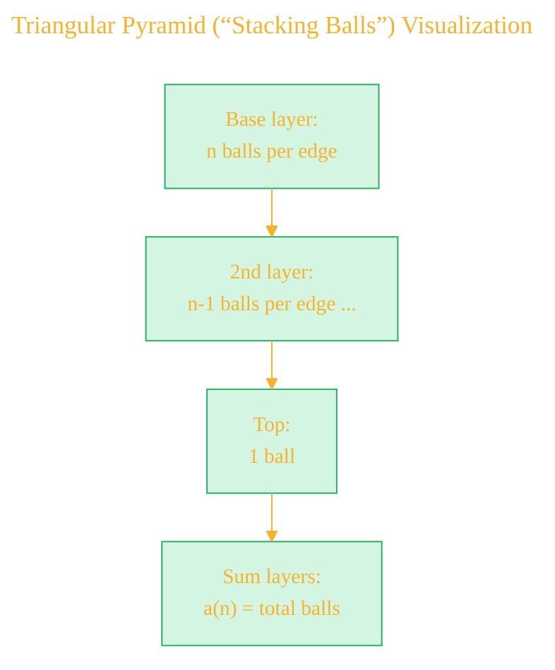

### b. Polyhedral Numbers Context

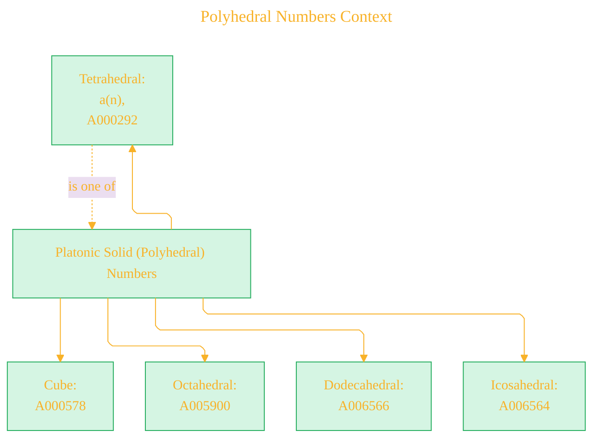

---

## 3. Combinatorial Interpretations

### a. Multinomial and Permutation Structures

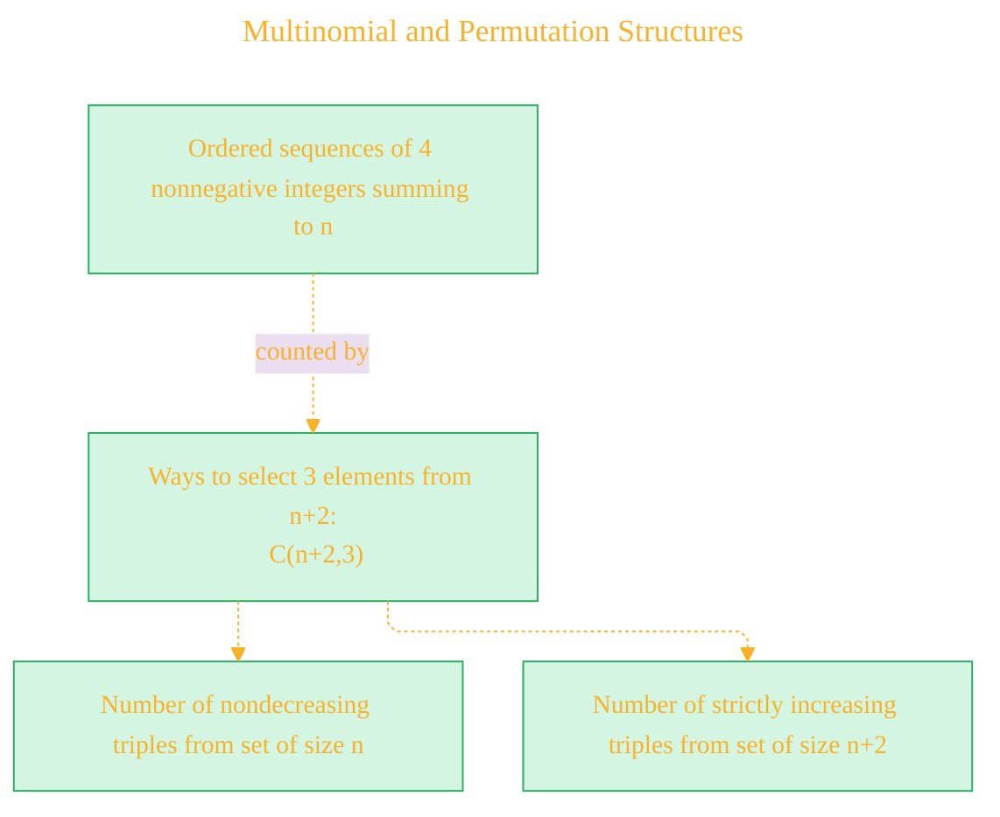

### b. Partition and Coloring

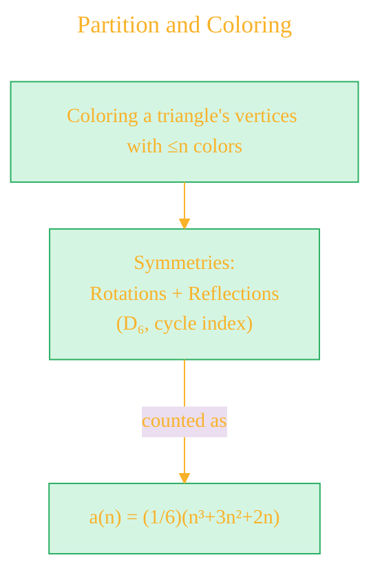

---

## 4. Algebraic, Matrix, and Recurrence Connections

### a. Linear Recurrence

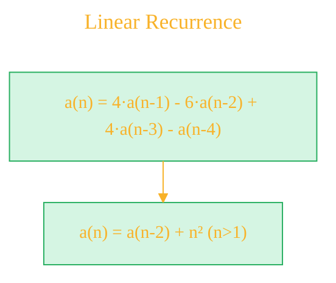

### b. Pascal Matrix and Related Diagonals

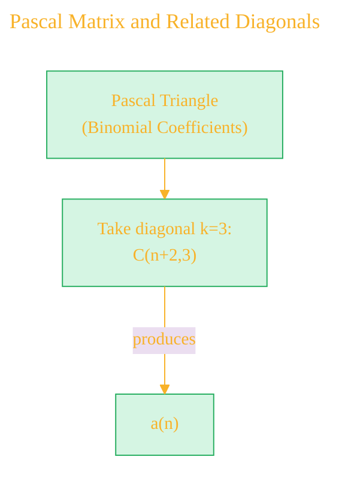

### c. Matrix Determinant

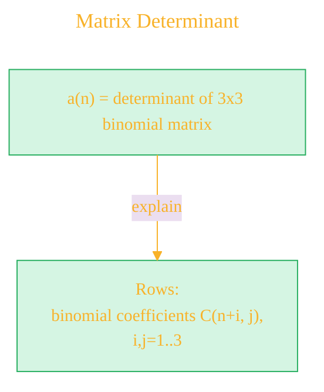

---

## 5. Geometric and Graph Theoretical Links

### a. Triangular Matchsticks, Grid Circles, Polytope Vertices

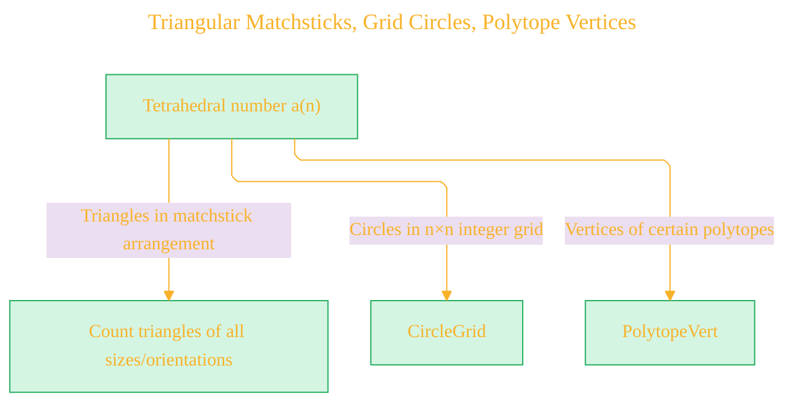

### b. Wiener Index and Graphs

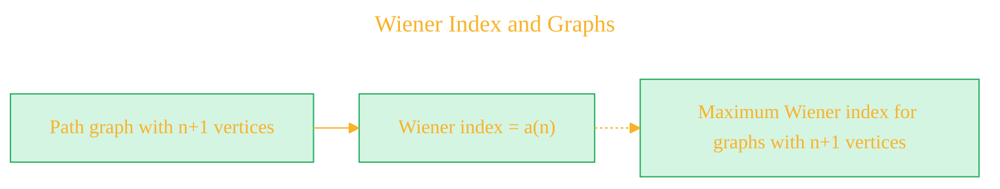

---

## 6. Relations to Related Sequences (OEIS Crosslinks)

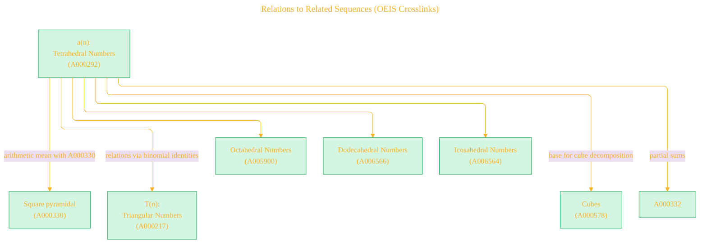

---

## 7. Computational and Algorithmic Aspects

### a. Common Code / Generating Program Map

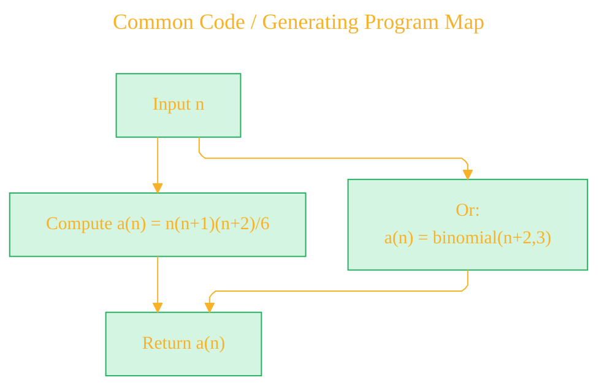

---

## 8. Symmetry, Recurrence, and "Matryoshka" Patterns

### a. Matryoshka/Folded Structure

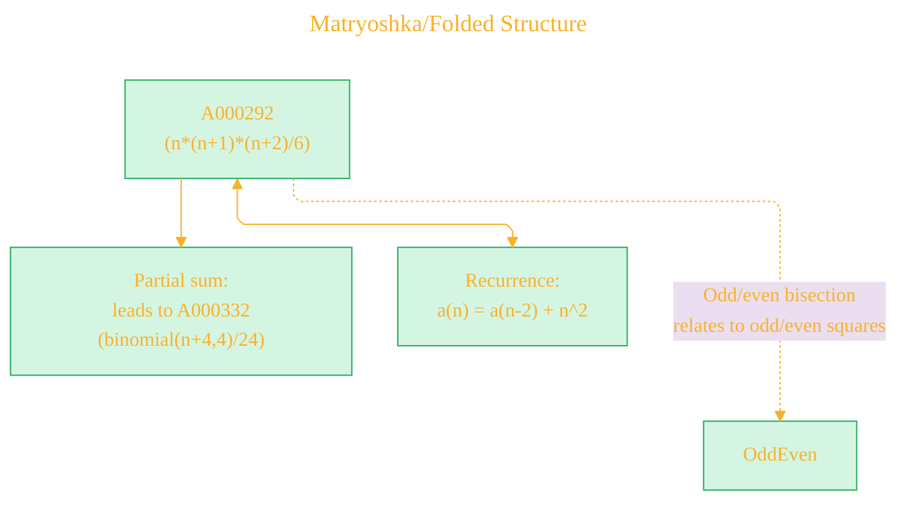

---

## 9. Applications and Appearances

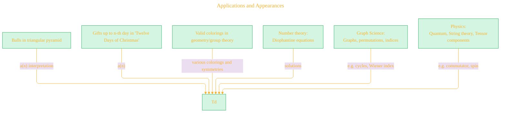

---

## 10. Summary Table: Central Identities and Properties - TODO 

```mermaid
classDiagram
    class TetrahedralNumber {
        + a(n) = binomial(n+2, 3)
        + a(n) = n(n+1)(n+2)/6
        + G.f.: x / (1-x)^4
        + E.g.f.: (x³/6 + x² + x)·eˣ
        + Recurrence: a(n) = 4a(n-1) - 6a(n-2) + 4a(n-3) - a(n-4)
        + Partial sum: Σₖ₌₀ⁿ T(k)
        + Antidiagonal sum: in multiplication table
        + Matrix det: see documentation
        + a(n) = sum_{k=1}^n sum_{j=0}^k j
        + a(n) ~ n³/6 (asymptotic)
    }
```

---

## 11. Interlinked Structures, Themes, and Cross-Domain Connections

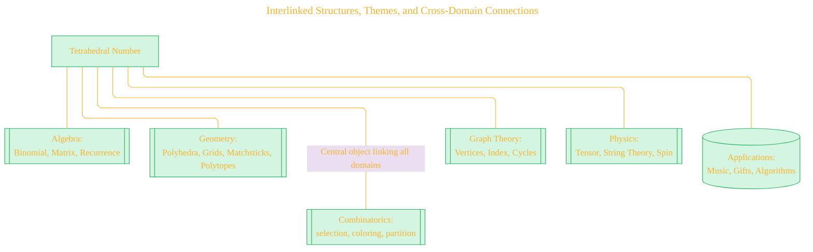

---

## 12. Growth Pattern and Sequence Visualization

### a. Initial Values Chart (Compact)

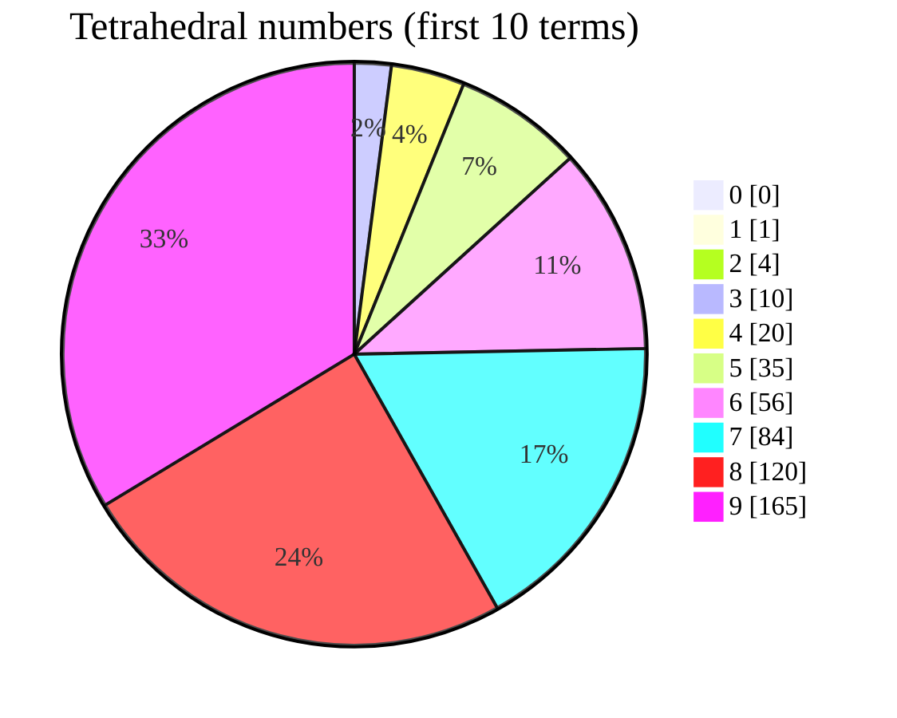

---

## 13. Primary Cross-References Navigable Map

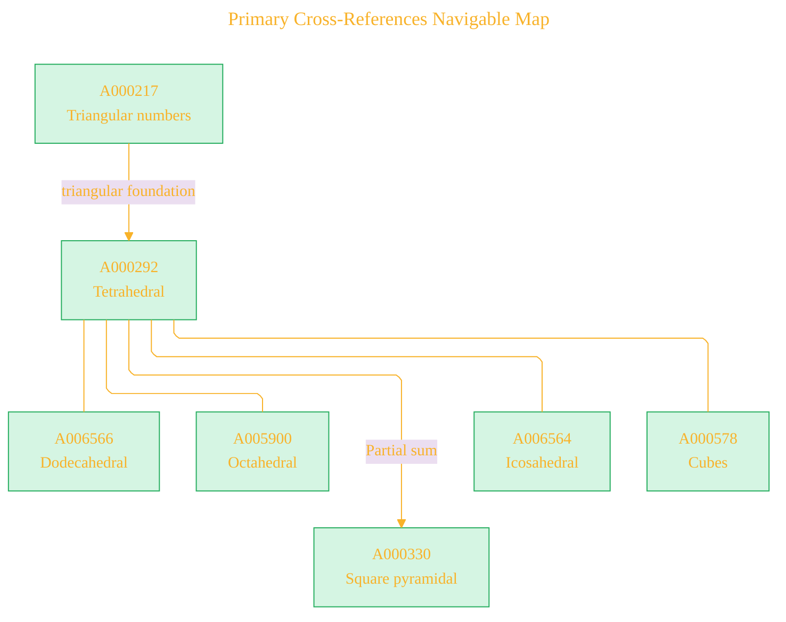

---

## 14. Antidiagonal in Multiplication Table Illustration

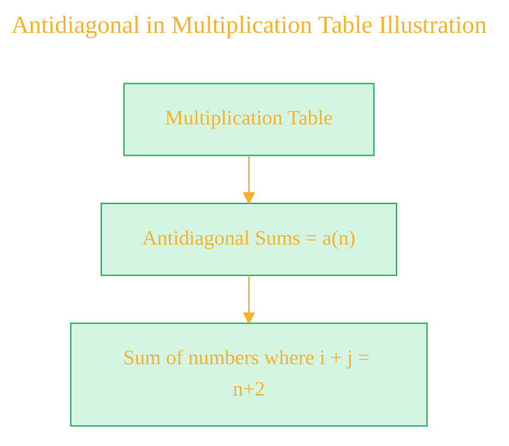

---

## 15. Symmetries and Colorings in Triangles

```mermaid
---
title: "Symmetries and Colorings in Triangles"
author: "Cong Le"
version: "1.0"
license(s): "MIT, CC BY 4.0"
copyright: "Copyright (c) 2025 Cong Le. All Rights Reserved."
config:
  layout: elk
  theme: base
---
%%%%%%%% Mermaid version v11.4.1-b.14
%%%%%%%% Available curve styles include the following keywords:
%% basis, bumpX, bumpY, cardinal, catmullRom, linear, monotoneX, monotoneY, natural, step, stepAfter, stepBefore.
%%{
  init: {
    'flowchart': { 'htmlLabels': true, 'curve': 'linear' },
    'fontFamily': 'Monaco',
    'themeVariables': {
      'primaryColor': '#D5F5E3',
      'primaryTextColor': '#F8B229',
      'lineColor': '#F8B229',
      'primaryBorderColor': '#27AE60',
      'secondaryColor': '#EBDEF0',
      'secondaryTextColor': '#6C3483',
      'secondaryBorderColor': '#A569BD',
      'fontSize': '15px'
    }
  }
}%%
flowchart TD
    TriangleVertices["Triangle Vertices:<br/> 3"]
    ColorChoices["≤ n colors"]
    SymmGroup["Dihedral Group D₆:<br/> Rotations & Reflections"]
    Z["Cycle Index:<br/> (x₁³ + 2x₃ + 3x₁x₂)/6"]
    
    TriangleVertices --> ColorChoices --> SymmGroup --> Z
    
    Z -->|"counts up to symmetry"| ColorCount["a(n)"]
    
```


---

**License and Attribution**

> - Mathematical data and exposition adapted from **The Online Encyclopedia of Integer Sequences** (<https://oeis.org/>), [OEIS sequence A000292](https://oeis.org/A000292), © OEIS Foundation Inc., licensed under [CC BY-SA 4.0](https://creativecommons.org/licenses/by-sa/4.0/) [](https://creativecommons.org/licenses/by-sa/4.0/).
> - Legal details in [LICENSE-CC-BY-SA-4.0](LICENSE-CC-BY-SA-4.0) and at [Creative Commons official site](https://creativecommons.org/licenses/by-sa/4.0/).
> - Diagram and explanatory code © 2025 Cong Le, **MIT License** [](LICENSE) (for code **only**)- Full text in [LICENSE](LICENSE) file.  
>  
> - If you adapt, redistribute, or make derivative works involving *OEIS-based content*, you must retain this notice and apply **CC BY-SA 4.0**.

---

