# Visualizing OEIS Sequence A000578 (The Cubes: a(n) = n³) - Draft

> **Source Attribution:**
>
> This document incorporates or adapts material from:
> - **The Online Encyclopedia of Integer Sequences** ([https://oeis.org/](https://oeis.org/))
> - Specific sequence: [OEIS A000578](https://oeis.org/A000578)
> - **© The OEIS Foundation Inc.**
>
> **License:**
> 
> - **OEIS-derived content** (any mathematical data, structure, text, or visuals based on OEIS): **CC BY-SA 4.0**
> - If you adapt/redistribute these portions, you **must** provide attribution as above and license your derivative work under the same terms.
> - **Original diagram source code** (e.g., Mermaid, PlantUML, or script syntax BY CONG LE, not including OEIS math/data): **MIT License**, unless otherwise stated.
> - If you reuse just the code itself for unrelated subjects, **MIT** applies.

---


This document explores and visually illustrates the mathematical, combinatorial, geometric, and algebraic properties of the sequence **A000578: The Cubes** as detailed in the OEIS entry. Below is a set of interconnected diagrams (in Mermaid syntax) that together clarify and synthesize the main ideas, connections, and formulas present in [the comprehensive OEIS documentation](https://oeis.org/A000578).

---

## 1. Sequence Overview and Core Formula


---

## 2. Mathematical Properties: Prime Factorization & Multiplicativity

```mermaid
---
title: "Mathematical Properties: Prime Factorization & Multiplicativity"
author: "Cong Le"
version: "1.0"
license(s): "MIT, CC BY-SA 4.0"
copyright: "Copyright (c) 2025 Cong Le. All Rights Reserved."
config:
  layout: elk
  theme: base
---
%%%%%%%% Mermaid version v11.4.1-b.14
%%%%%%%% Available curve styles include the following keywords:
%% basis, bumpX, bumpY, cardinal, catmullRom, linear, monotoneX, monotoneY, natural, step, stepAfter, stepBefore.
%%{
  init: {
    'flowchart': { 'htmlLabels': true, 'curve': 'linear' },
    'fontFamily': 'Monaco',
    'themeVariables': {
      'primaryColor': '#D5F5E3',
      'primaryTextColor': '#F8B229',
      'lineColor': '#F8B229',
      'primaryBorderColor': '#27AE60',
      'secondaryColor': '#EBDEF0',
      'secondaryTextColor': '#6C3483',
      'secondaryBorderColor': '#A569BD',
      'fontSize': '15px'
    }
  }
}%%
flowchart TD
    A1["a(n) is totally multiplicative"]
    A1 -->|"for prime p"| A2["a(p) = p³"]
    A1 -->|"for prime power"| A3["a(p^e) = p^{3e}"]
    B1["Test for cube:"]
    B1 --> B2["n is a cube ⇔ for every p | n, exponent ≡ 0 mod 3"]
    
```



---

## 3. Main Formulas (Algebraic, Generating Functions, Binomial)

```mermaid
---
title: "Main Formulas (Algebraic, Generating Functions, Binomial)"
author: "Cong Le"
version: "1.0"
license(s): "MIT, CC BY-SA 4.0"
copyright: "Copyright (c) 2025 Cong Le. All Rights Reserved."
config:
  layout: elk
  theme: base
---
%%%%%%%% Mermaid version v11.4.1-b.14
%%%%%%%% Available curve styles include the following keywords:
%% basis, bumpX, bumpY, cardinal, catmullRom, linear, monotoneX, monotoneY, natural, step, stepAfter, stepBefore.
%%{
  init: {
    'flowchart': { 'htmlLabels': true, 'curve': 'linear' },
    'fontFamily': 'Monaco',
    'themeVariables': {
      'primaryColor': '#D5F5E3',
      'primaryTextColor': '#F8B229',
      'lineColor': '#F8B229',
      'primaryBorderColor': '#27AE60',
      'secondaryColor': '#EBDEF0',
      'secondaryTextColor': '#6C3483',
      'secondaryBorderColor': '#A569BD',
      'fontSize': '15px'
    }
  }
}%%
flowchart LR
    A1["Direct Formula"] ---|"for all n"| A2["a(n) = n³"]
    A3["Partial Sums"] --- A4["sum_{k=1}^n k³ = (n(n+1)/2)²"]
    A5["Sum of Odd Number Groups"] --- A2
    
    subgraph Generating_Functions["Generating Functions"]
        B1["g.f.<br/> x(1+4x+x²)/(1-x)^4"]
        B2["e.g.f.<br/> (1+3x+x²)x*exp(x)"]
        B3["Dirichlet g.f.<br/> ζ(s-3)"]
    end
    
    A2 ---|"Binomial Decomp"| A6["a(n) = binom(n+2,3) + 4*binom(n+1,3) + binom(n,3)"]
    A2 ---|"Linear Rec"| A7["a(n) = 4a(n-1) - 6a(n-2) + 4a(n-3) - a(n-4)"]
    A2 ---|"Moebius inversion"| A8["a(n) = Σ_{d|n} σ₃(d) * μ(n/d)"]
    
```



---

## 4. Combinatorial and Geometric Interpretations

### a. Odd Number Grouping and Sums

```mermaid
---
title: "Odd Number Grouping and Sums"
author: "Cong Le"
version: "1.0"
license(s): "MIT, CC BY-SA 4.0"
copyright: "Copyright (c) 2025 Cong Le. All Rights Reserved."
config:
  layout: elk
  theme: base
---
%%%%%%%% Mermaid version v11.4.1-b.14
%%%%%%%% Available curve styles include the following keywords:
%% basis, bumpX, bumpY, cardinal, catmullRom, linear, monotoneX, monotoneY, natural, step, stepAfter, stepBefore.
%%{
  init: {
    'flowchart': { 'htmlLabels': true, 'curve': 'linear' },
    'fontFamily': 'Monaco',
    'themeVariables': {
      'primaryColor': '#D5F5E3',
      'primaryTextColor': '#F8B229',
      'lineColor': '#F8B229',
      'primaryBorderColor': '#27AE60',
      'secondaryColor': '#EBDEF0',
      'secondaryTextColor': '#6C3483',
      'secondaryBorderColor': '#A569BD',
      'fontSize': '15px'
    }
  }
}%%
flowchart TD
    AA1["Odd Numbers Arranged in n Groups:<br/>(1), (3,5), (7,9,11), ..."]
    AA1 --> AA2["Sum of n-th group = n³"]
    AA2 --> AA3["Median = n² = Mean"]
    AA4["Sum of first n odd numbers <br/>= n² → partial sum formula proof"]
    
```



### b. Polyhedral and Spatial Representations

```mermaid
---
title: "Polyhedral and Spatial Representations"
author: "Cong Le"
version: "1.0"
license(s): "MIT, CC BY-SA 4.0"
copyright: "Copyright (c) 2025 Cong Le. All Rights Reserved."
config:
  layout: elk
  theme: base
---
%%%%%%%% Mermaid version v11.4.1-b.14
%%%%%%%% Available curve styles include the following keywords:
%% basis, bumpX, bumpY, cardinal, catmullRom, linear, monotoneX, monotoneY, natural, step, stepAfter, stepBefore.
%%{
  init: {
    'flowchart': { 'htmlLabels': true, 'curve': 'linear' },
    'fontFamily': 'Monaco',
    'themeVariables': {
      'primaryColor': '#D5F5E3',
      'primaryTextColor': '#F8B229',
      'lineColor': '#F8B229',
      'primaryBorderColor': '#27AE60',
      'secondaryColor': '#EBDEF0',
      'secondaryTextColor': '#6C3483',
      'secondaryBorderColor': '#A569BD',
      'fontSize': '15px'
    }
  }
}%%
flowchart TB
    BB1["Platonic Solids"]
    BB1 --> BB2["Tetrahedral<br/> A000292"]
    BB1 --> BB3["Cube<br/> A000578 🎯"]
    BB1 --> BB4["Octahedral<br/> A005900"]
    BB1 --> BB5["Dodecahedral<br/> A006566"]
    BB1 --> BB6["Icosahedral<br/> A006564"]
    BB3 ---> BB7["Schlaefli symbol<br/> {4,3}"]
    BB8["Atoms in bcc rhombic hexahedron with n atoms/edge = n³"]
    
```



### c. Partitioned Hexagon Tiling

```mermaid
---
title: "Partitioned Hexagon Tiling"
author: "Cong Le"
version: "1.0"
license(s): "MIT, CC BY-SA 4.0"
copyright: "Copyright (c) 2025 Cong Le. All Rights Reserved."
config:
  layout: elk
  theme: base
---
%%%%%%%% Mermaid version v11.4.1-b.14
%%%%%%%% Available curve styles include the following keywords:
%% basis, bumpX, bumpY, cardinal, catmullRom, linear, monotoneX, monotoneY, natural, step, stepAfter, stepBefore.
%%{
  init: {
    'flowchart': { 'htmlLabels': true, 'curve': 'linear' },
    'fontFamily': 'Monaco',
    'themeVariables': {
      'primaryColor': '#D5F5E3',
      'primaryTextColor': '#F8B229',
      'lineColor': '#F8B229',
      'primaryBorderColor': '#27AE60',
      'secondaryColor': '#EBDEF0',
      'secondaryTextColor': '#6C3483',
      'secondaryBorderColor': '#A569BD',
      'fontSize': '15px'
    }
  }
}%%
flowchart TD
    HC["Regular Hexagon Partitioned"]
    HC -->|"Divide each side into n equal segments<br/>Draw all possible internal lines"| HD["Triangular Tiling"]
    HD -->|"Count Regular Hexagons"| HE["Total = a(n) = n³"]
    HE --> HF["e.g., 2 points/side ⇒ n=3 ⇒ a(3)=27"]
    
```



### d. Combinatorial Colorings

```mermaid
---
title: "Combinatorial Colorings"
author: "Cong Le"
version: "1.0"
license(s): "MIT, CC BY-SA 4.0"
copyright: "Copyright (c) 2025 Cong Le. All Rights Reserved."
config:
  layout: elk
  theme: base
---
%%%%%%%% Mermaid version v11.4.1-b.14
%%%%%%%% Available curve styles include the following keywords:
%% basis, bumpX, bumpY, cardinal, catmullRom, linear, monotoneX, monotoneY, natural, step, stepAfter, stepBefore.
%%{
  init: {
    'flowchart': { 'htmlLabels': true, 'curve': 'linear' },
    'fontFamily': 'Monaco',
    'themeVariables': {
      'primaryColor': '#D5F5E3',
      'primaryTextColor': '#F8B229',
      'lineColor': '#F8B229',
      'primaryBorderColor': '#27AE60',
      'secondaryColor': '#EBDEF0',
      'secondaryTextColor': '#6C3483',
      'secondaryBorderColor': '#A569BD',
      'fontSize': '15px'
    }
  }
}%%
flowchart TD
    CC1["Cube Face Colorings"]
    CC1 -->|"number of inequivalent ways"| CC2["Using at most n colors &<br/> each color appears ≥2"]
    CC2 -->|"total"| CC3["a(n):<br/> n³"]
    
```



---

## 5. Diophantine Equations Connections

```mermaid
---
title: "Diophantine Equations Connections"
author: "Cong Le"
version: "1.0"
license(s): "MIT, CC BY-SA 4.0"
copyright: "Copyright (c) 2025 Cong Le. All Rights Reserved."
config:
  layout: elk
  theme: base
---
%%%%%%%% Mermaid version v11.4.1-b.14
%%%%%%%% Available curve styles include the following keywords:
%% basis, bumpX, bumpY, cardinal, catmullRom, linear, monotoneX, monotoneY, natural, step, stepAfter, stepBefore.
%%{
  init: {
    'flowchart': { 'htmlLabels': true, 'curve': 'linear' },
    'fontFamily': 'Monaco',
    'themeVariables': {
      'primaryColor': '#D5F5E3',
      'primaryTextColor': '#F8B229',
      'lineColor': '#F8B229',
      'primaryBorderColor': '#27AE60',
      'secondaryColor': '#EBDEF0',
      'secondaryTextColor': '#6C3483',
      'secondaryBorderColor': '#A569BD',
      'fontSize': '15px'
    }
  }
}%%
flowchart TD
    DA1["(X/Y)² - XY = 0"]
    DA1 -->|Soln| DA2["(n³, n),<br/> n ≥ 1"]
    DA3["(m²)(X/Y)^{2k} - XY = 0"]
    DA3 -->|Soln| DA4["(m·n^{2k+1}, m·n^{2k-1}),<br/> m,k,n ≥ 1"]
    DA5["(m²)(X/Y)^{2k+1} - XY=0"]
    DA5 -->|Soln| DA6["(m·n^{k+1},<br/> m·n^k)"]
    
```



---

## 6. Relationships with Other Sequences


---

## 7. Geometric Group/Number Triangle Construction (For n=4 Example)


---

## 8. Special Sums, Products and Zeta Functions

```mermaid
---
title: "Special Sums, Products and Zeta Functions"
author: "Cong Le"
version: "1.0"
license(s): "MIT, CC BY-SA 4.0"
copyright: "Copyright (c) 2025 Cong Le. All Rights Reserved."
config:
  layout: elk
  theme: base
---
%%%%%%%% Mermaid version v11.4.1-b.14
%%%%%%%% Available curve styles include the following keywords:
%% basis, bumpX, bumpY, cardinal, catmullRom, linear, monotoneX, monotoneY, natural, step, stepAfter, stepBefore.
%%{
  init: {
    'flowchart': { 'htmlLabels': true, 'curve': 'linear' },
    'fontFamily': 'Monaco',
    'themeVariables': {
      'primaryColor': '#D5F5E3',
      'primaryTextColor': '#F8B229',
      'lineColor': '#F8B229',
      'primaryBorderColor': '#27AE60',
      'secondaryColor': '#EBDEF0',
      'secondaryTextColor': '#6C3483',
      'secondaryBorderColor': '#A569BD',
      'fontSize': '15px'
    }
  }
}%%
flowchart TD
    E1["Sum_{n>=1} 1/a(n)"]
    E1 --> E2["= ζ(3)<br/>(Apéry's Constant)"]

    E3["Sum_{n≥1} (-1)^(n+1)/a(n)"]
    E3 --> E4["= 3ζ(3)/4"]

    E5["Product_{n≥1} (1 + 1/a(n))"]
    E5 --> E6["= cosh(√3·π/2)/π"]

    E7["Product_{n≥2} (1 - 1/a(n))"]
    E7 --> E8["= cosh(√3·π/2)/(3π)"]
    
```



---

## 9. Triangle Partition Interpretation


---

## 10. Recurrences and Difference Equations


---

## 11. Computation (Programs, Implementations) - TODO

```mermaid
classDiagram
    class Maple {
        a(n): n^3
    }
    class Mathematica {
        Table[n^3, {n, 0, N}]
    }
    class Python {
        "a_list, m = [], [6,-6,1,0]
        for _ in range(100):
            a_list.append(m[-1])
            for i in range(3): m[i+1]+=m[i]"
    }
    class Haskell {
        a000578 = (^3)
        a000578_list = 0:1:8: zipWith (+) (map (+6) a000578_list) (map (*3) $ tail $ zipWith (-) (tail a000578_list) a000578_list)
    }
    class PariGP {
        a(n) = n^3
        is(n) = ispower(n, 3)
    }
    class Magma {
        [n^3: n in [0..N]]
    }
```

---

## 12. Broader Mathematical Context and Cross-References


---

## 13. Sequence Relationships Mindmap

```mermaid
---
title: "Sequence Relationships"
author: "Cong Le"
version: "1.0"
license(s): "MIT, CC BY-SA 4.0"
copyright: "Copyright (c) 2025 Cong Le. All Rights Reserved."
config:
  theme: base
---
%%%%%%%% Mermaid version v11.4.1-b.14
%%{
  init: {
    'fontFamily': 'Monaco',
    'themeVariables': {
      'primaryColor': '#D5F5E3',
      'primaryTextColor': '#22B',
      'lineColor': '#F8B229',
      'primaryBorderColor': '#27AE60',
      'secondaryColor': '#EBDEF0',
      'secondaryTextColor': '#6C3483',
      'secondaryBorderColor': '#A569BD',
      'fontSize': '20px'
    }
  }
}%%
mindmap
root(("A000578<br/> Cubes n³"))
    Properties("Properties")
      Multiplicative["Multiplicative"]
      Totally_multiplicative["Totally multiplicative"]
      Formulas["Formulas: Partial Sums (triangular numbers squared)"]
      Partial_Sums["Partial Sums: A000537"]
      Tests["Tests: Exponents mod 3"]
    Combinatorics("Combinatorics")
      Odd_number_groupings["Odd number groupings (n-th sum is n³)"]
      Compositions_avoiding_parts["Compositions avoiding parts 2, 3"]
      Triangle_tilings["Triangle tilings"]
    Geometry("Geometry")
      Platonic_solids["Platonic solids: Cube"]
      bcc_rhombic_hexahedron["bcc rhombic hexahedron"]
      Schlaefli["Schlaefli: {4,3}"]
    Algebra("Algebra")
      Recurrences_of_order_4["Recurrences of order 4"]
      Moebius_transform_of_sigma["Moebius transform of sigma₃"]
    Analysis("Analysis")
      Sums_and_Products["Sums and Products → Zeta(3),<br/> hyperbolic cosine with π"]
    Programs("Programs")
      Implementation["Implementation in Maple, Mathematica, Python, Haskell, Magma, Pari/GP"]
    Crossrefs("Crossrefs")
	    A000537
	    A003072
	    A003325
	    A024670
	    A048766
	    etc.
```




---

## Appendix: Visual Key

- **Boxes/arrows** represent relationships ("implies", "yields", "is instance of", "is related to") or definitions.
- **Class diagrams** show sample code implementations in various languages.
- **Mindmaps** and **flowcharts** summarize connections and groupings, including related sequences and interpretations.


---

**License and Attribution**

> - Mathematical data and exposition adapted from **The Online Encyclopedia of Integer Sequences** (<https://oeis.org/>), [OEIS sequence A000578](https://oeis.org/A000578), © OEIS Foundation Inc., licensed under [CC BY-SA 4.0](https://creativecommons.org/licenses/by-sa/4.0/) [](https://creativecommons.org/licenses/by-sa/4.0/).
> - Legal details in [LICENSE-CC-BY-SA-4.0](LICENSE-CC-BY-SA-4.0) and at [Creative Commons official site](https://creativecommons.org/licenses/by-sa/4.0/).
> - Diagram and explanatory code © 2025 Cong Le, **MIT License** [](LICENSE) (for code **only**)- Full text in [LICENSE](LICENSE) file.  
>  
> - If you adapt, redistribute, or make derivative works involving *OEIS-based content*, you must retain this notice and apply **CC BY-SA 4.0**.

---

