# Visualizing OEIS A005900 - Octahedral Numbers - Draft
> **Source Attribution:**
>
> This document incorporates or adapts material from:
> - **The Online Encyclopedia of Integer Sequences** ([https://oeis.org/](https://oeis.org/))
> - Specific sequence: [OEIS A005900](https://oeis.org/A005900)
> - **© The OEIS Foundation Inc.**
>
> **License:**
> 
> - **OEIS-derived content** (any mathematical data, structure, text, or visuals based on OEIS): **CC BY-SA 4.0**
> - If you adapt/redistribute these portions, you **must** provide attribution as above and license your derivative work under the same terms.
> - **Original diagram source code** (e.g., Mermaid, PlantUML, or script syntax BY CONG LE, not including OEIS math/data): **MIT License**, unless otherwise stated.
> - If you reuse just the code itself for unrelated subjects, **MIT** applies.

---

Below is a comprehensive set of Mermaid diagrams and and explanatory illustrations capturing the structure and complexity of A005900 (the octahedral numbers sequence) from [the OEIS](https://oeis.org/A005900), describing its formulas, geometric significance, combinatorial interpretations, recurrence relations, links to polyhedral numbers, and numerous mathematical properties.

---

## 1. What is OEIS A005900?

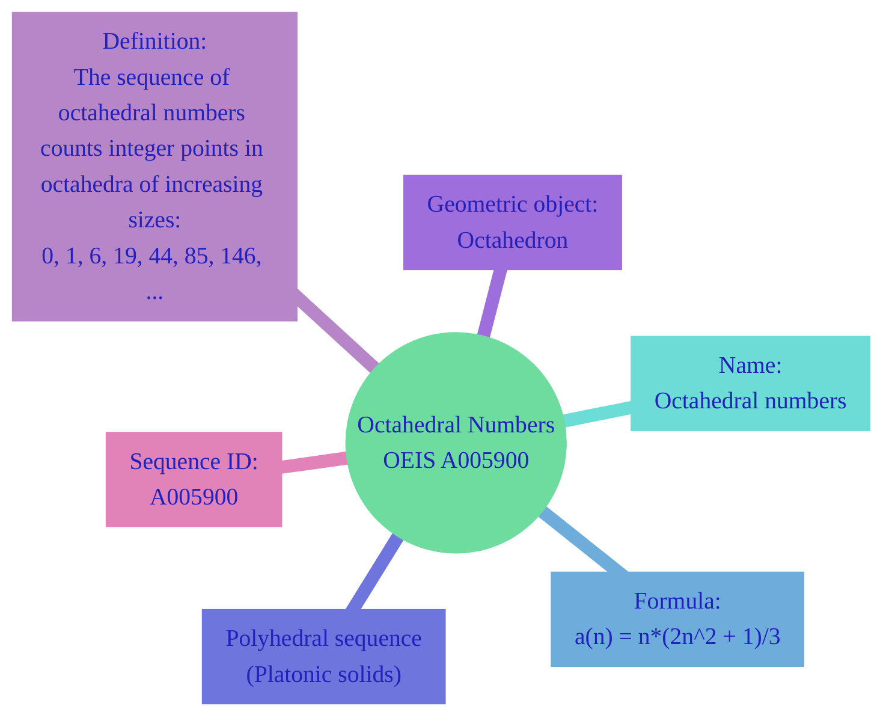
---

## 2. Sequence Structure & Core Formula

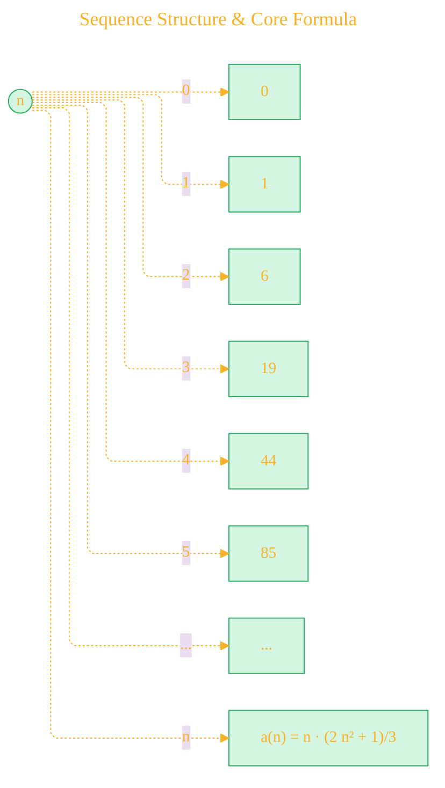

- **Offset:** `0,3` (Sequence starts at n=0; g.f. series offset)
- **General Term:**  a(n) = n·(2 n² + 1)/3

---

## 3. Defining Formulas and Equivalent Expressions

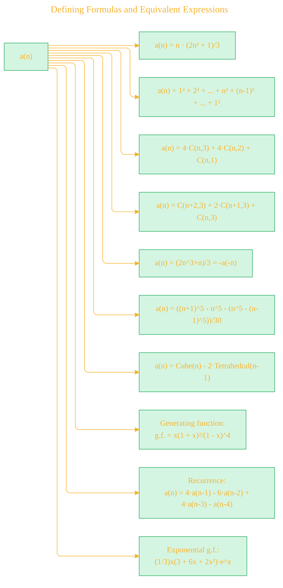

*Legend*:  
- `C(n,k)` = binomial coefficient  
- Cube(n) = n³  
- Tetrahedral(n-1) = (n-1)(n)(n+1)/6

---

## 4. Polyhedral Relationships & Geometry

### 4.1. Platonic Solid Numbers

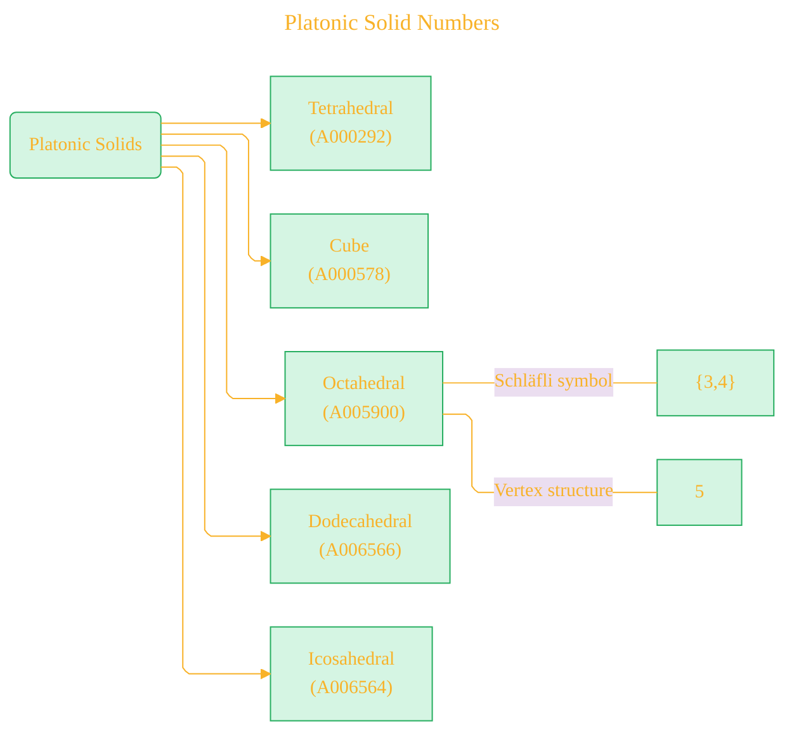

### 4.2. Geometry: Octahedral Layers

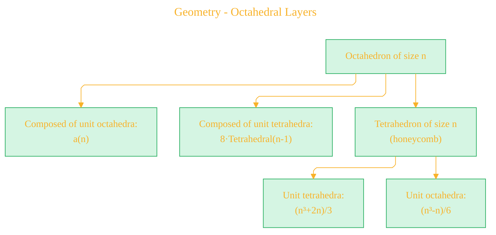

---

## 5. Combinatorial and Algebraic Interpretations

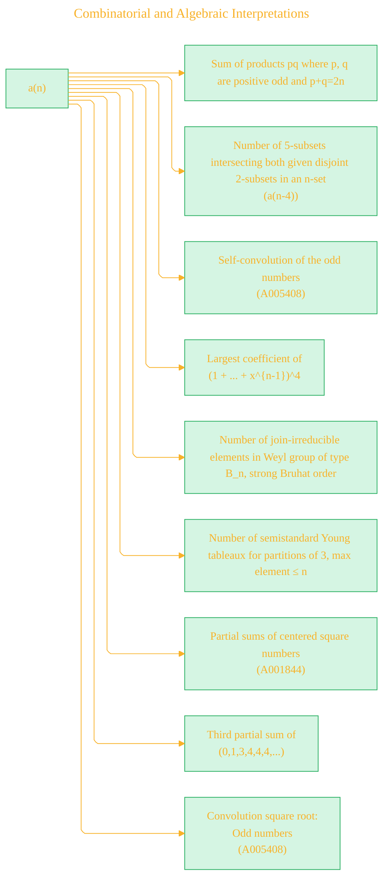

---

## 6. Recurrence and Generating Function - TODO

### 6.1. Recurrence

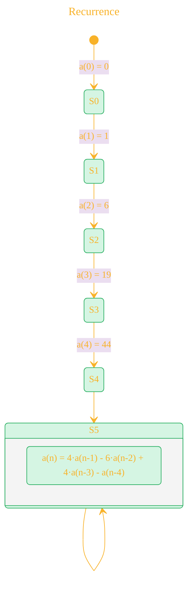

### 6.2. Generating Functions

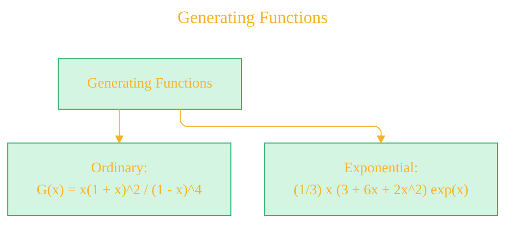

---

## 7. Algebraic & Programmatic Construction

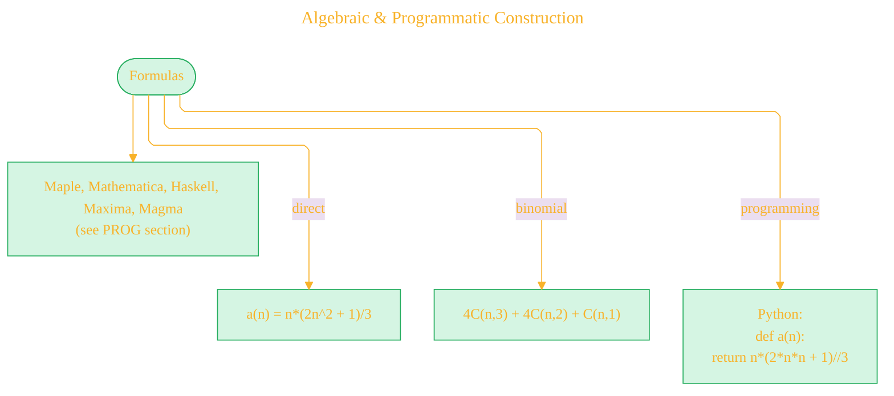

---

## 8. Inter-Sequence Links (Cross-References)

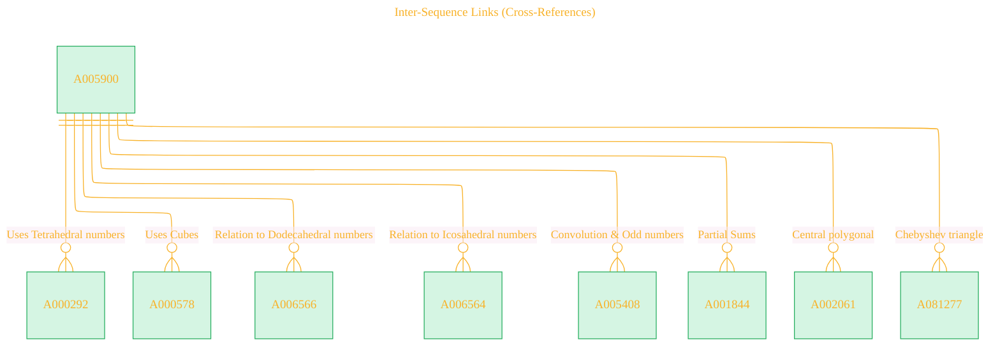


---

## 9. Summary: Application Contexts

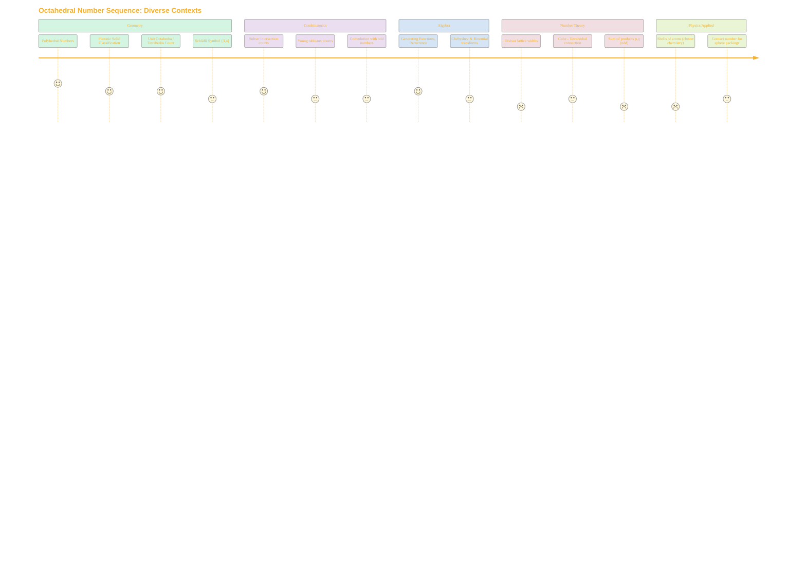


---

## 10. Relationships in the Polyhedral Number Family

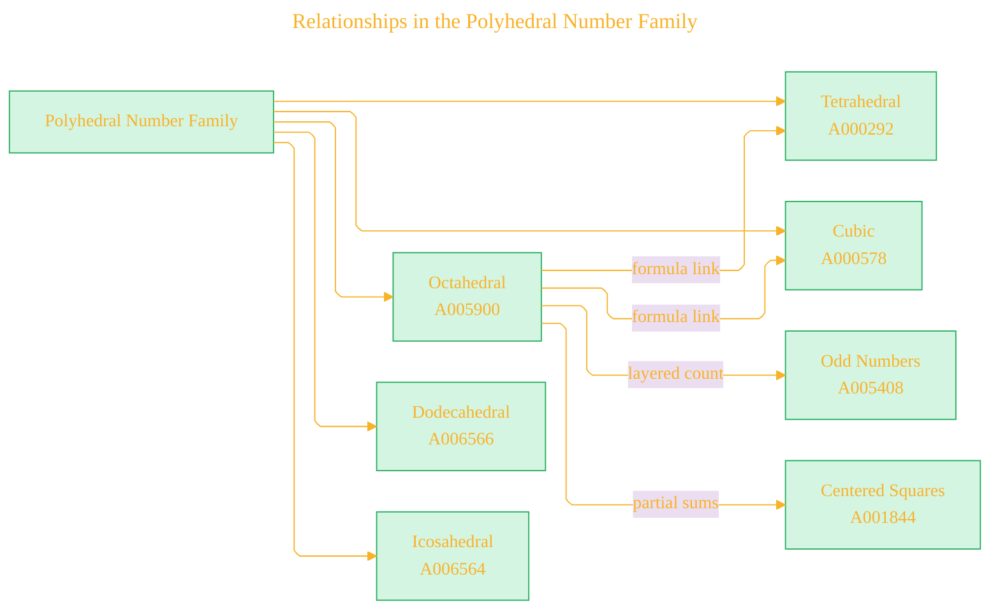

---

## 11. OEIS Document Structure Illustration

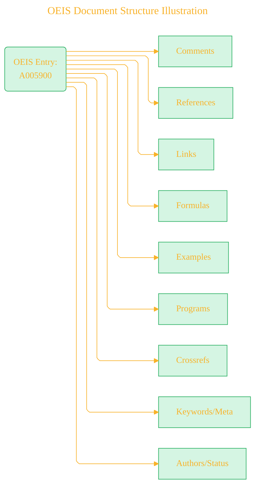

---

## 12. Example Calculation Tree

Example: a(4) = 44

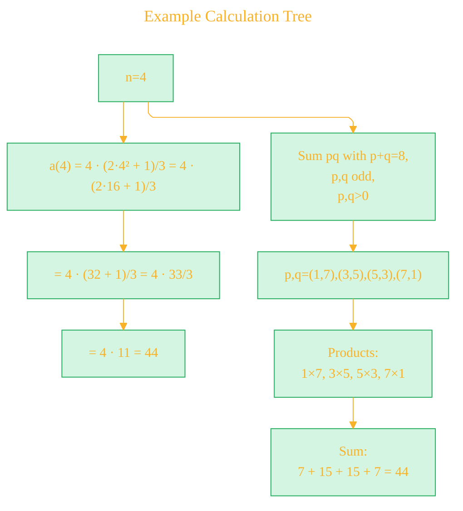
 

---

## 13. Sequence Recurrence Expansion (Order 4 rec.)

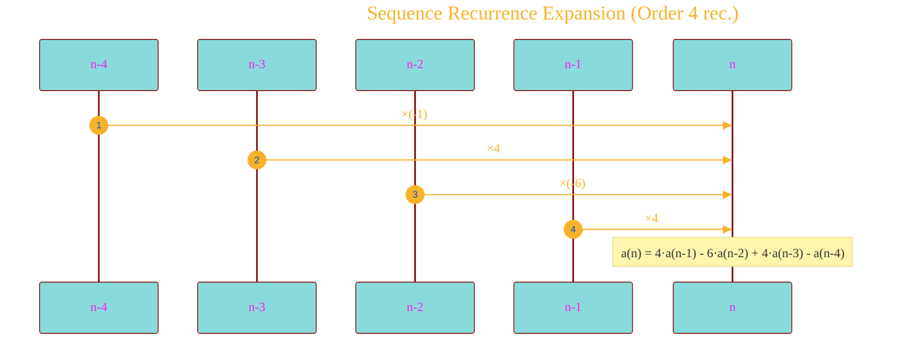

---

## 14. Generating Function Decomposition - TODO

```mermaid
flowchart LR
    G[x]((G(x))) --> F1["x(1+x)²/(1-x)^4"]
    F1 -->|expand| T1["x + 6x² + 19x³ + 44x⁴ + ..."]
    
```

---

## 15. Connections to Other Mathematical Objects

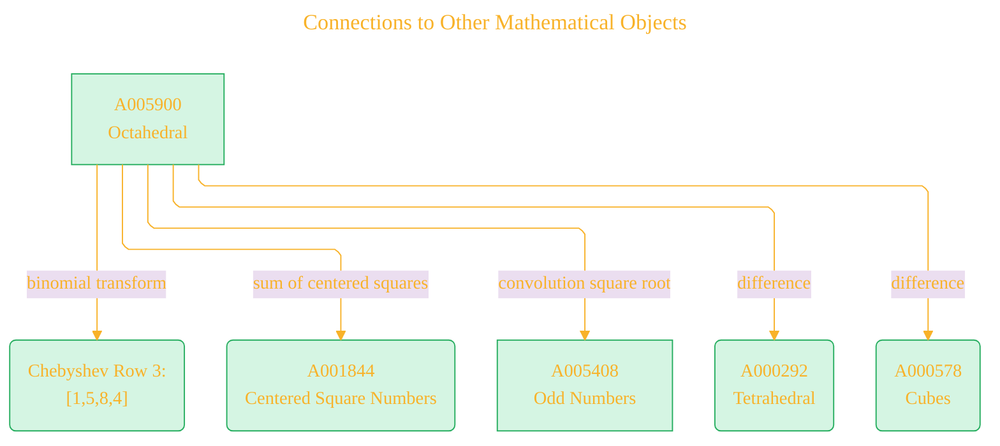

---

# Supplementary

## How to Compute - Algorithmic View

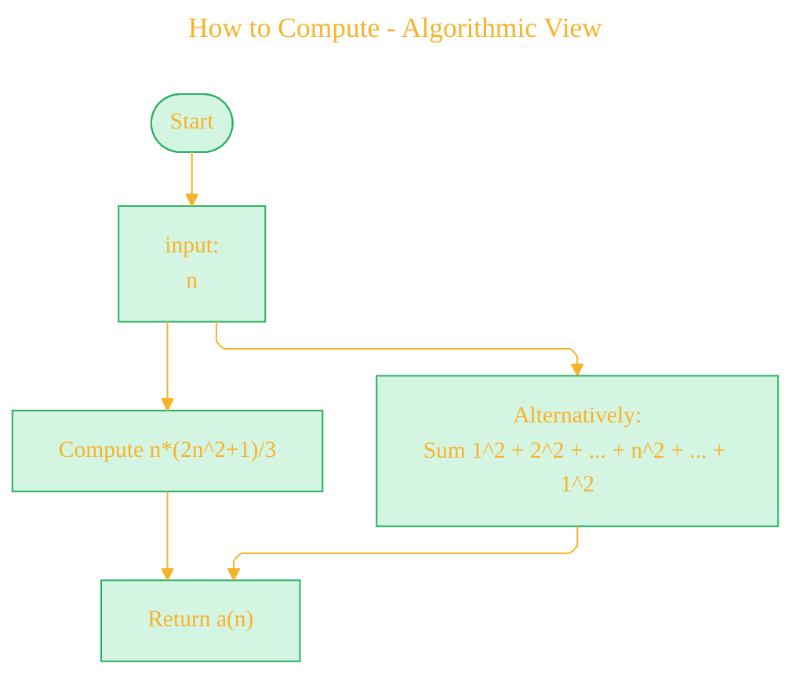

---

# Summary Table: All Key Concepts

| Area              | Details/Formula                                                            |
| ----------------- | -------------------------------------------------------------------------- |
| Name/ID           | Octahedral Numbers (OEIS A005900)                                          |
| Explicit Formula  | $a(n) = n·(2n² + 1)/3$, or sum of squares as listed above                    |
| Geometric Meaning | Counts number of points in n-sized octahedron; part of Platonic number set |
| Recurrence        | $a(n) = 4·a(n-1) - 6·a(n-2) + 4·a(n-3) - a(n-4)$                          |
| Gen. Function     | OGF: $x(1+x)²/(1-x)^4$; EGF: $(1/3)x(3+6x+2x²)e^x$                           |
| Cross-references  | Cubes, Tetrahedral, Dodecahedral, Icosahedral, Odd numbers, etc.           |
| Combinatorics     | Connections to subsets, Young tableaux, group theory (Weyl groups)         |
| Programs          | Implemented in Python, Maple, Mathematica, Haskell, and more               |


---

**License and Attribution**

> - Mathematical data and exposition adapted from **The Online Encyclopedia of Integer Sequences** (<https://oeis.org/>), [OEIS sequence A005900](https://oeis.org/A005900), © OEIS Foundation Inc., licensed under [CC BY-SA 4.0](https://creativecommons.org/licenses/by-sa/4.0/) [](https://creativecommons.org/licenses/by-sa/4.0/).
> - Legal details in [LICENSE-CC-BY-SA-4.0](LICENSE-CC-BY-SA-4.0) and at [Creative Commons official site](https://creativecommons.org/licenses/by-sa/4.0/).
> - Diagram and explanatory code © 2025 Cong Le, **MIT License** [](LICENSE) (for code **only**)- Full text in [LICENSE](LICENSE) file.  
>  
> - If you adapt, redistribute, or make derivative works involving *OEIS-based content*, you must retain this notice and apply **CC BY-SA 4.0**.

---

