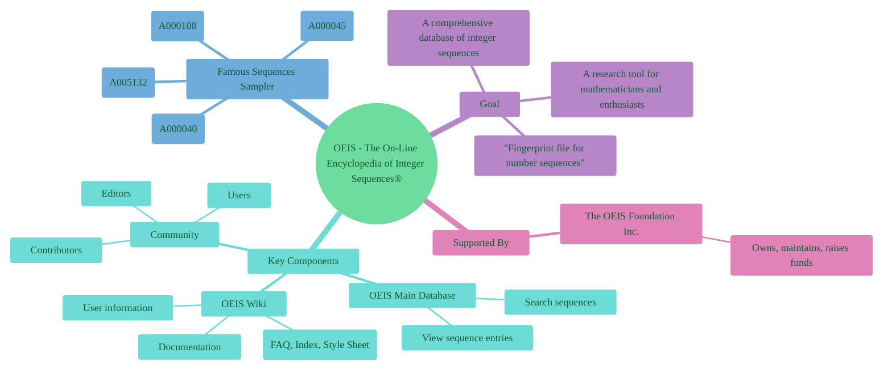
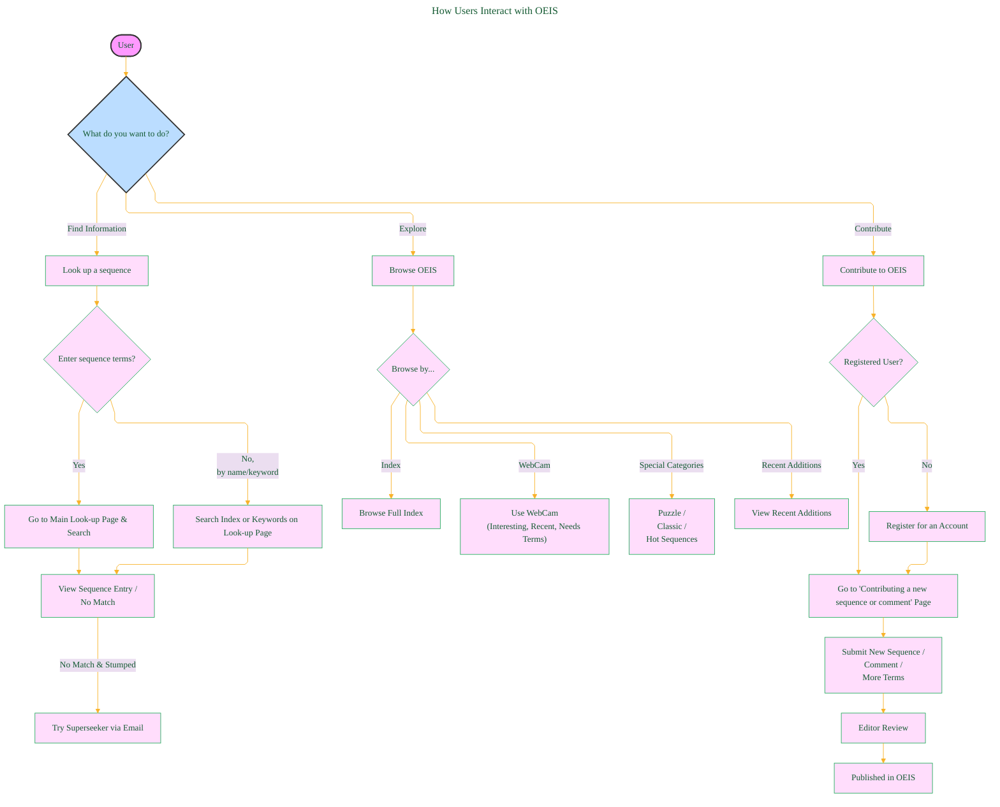
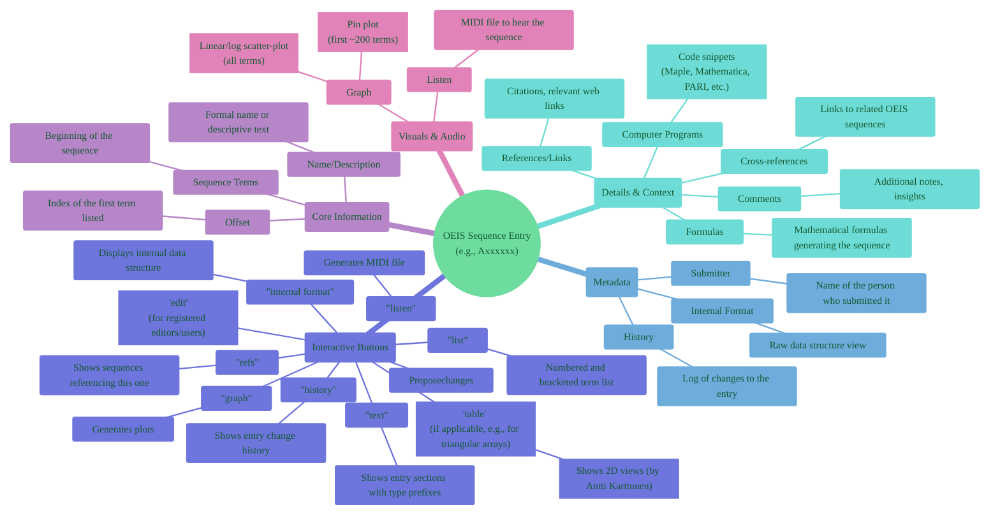
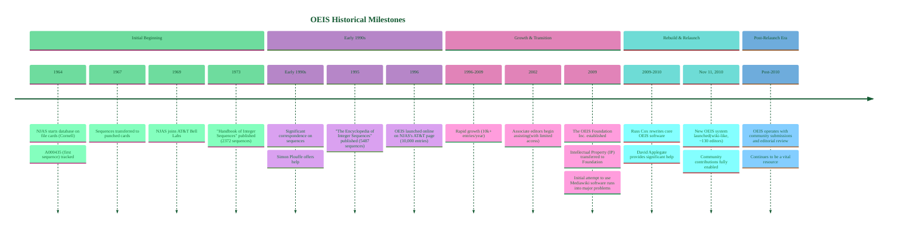
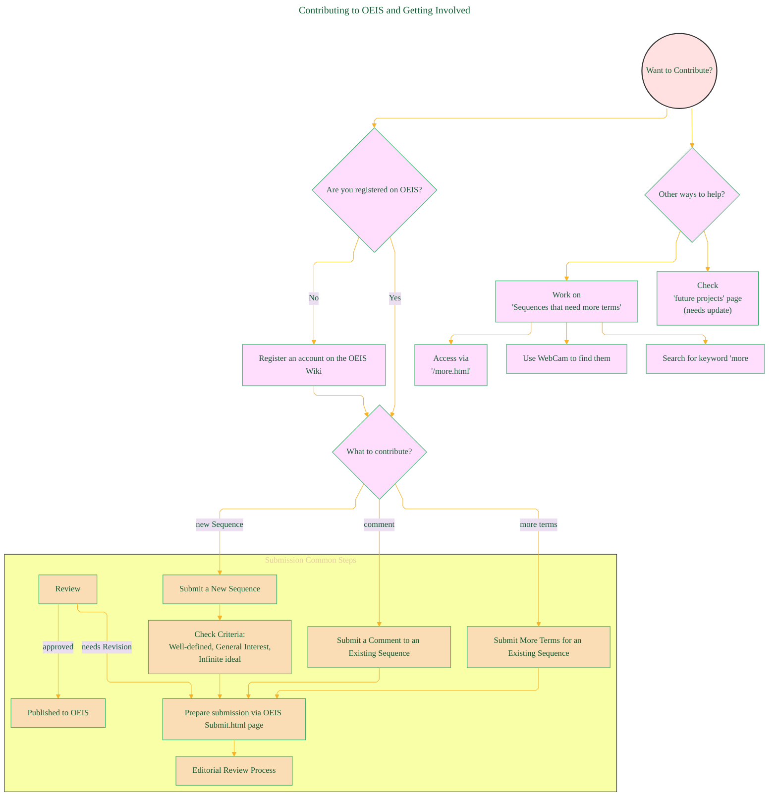
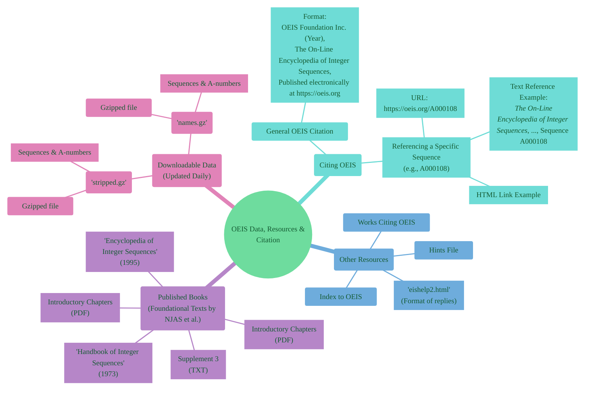
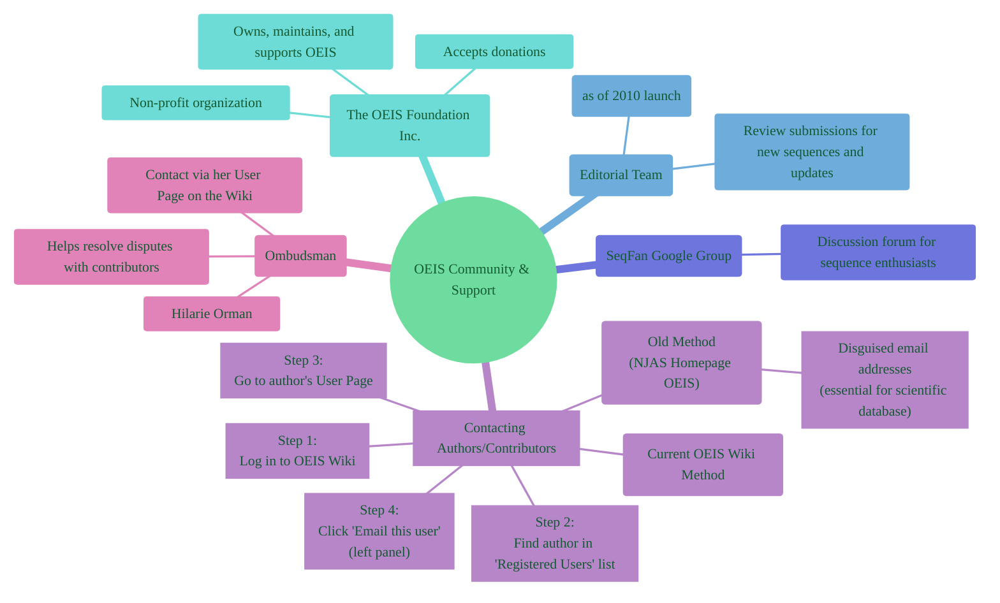
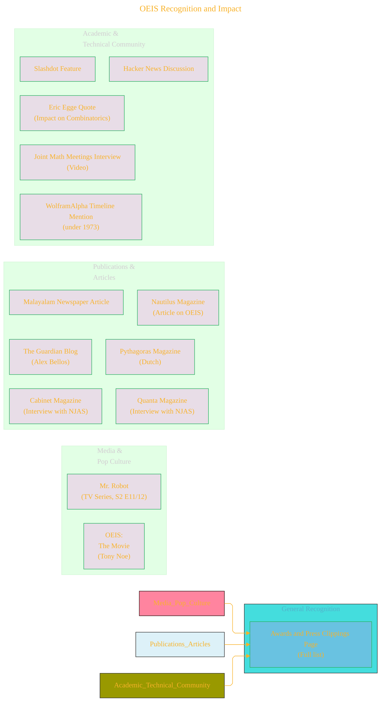

# Visualizing The On-Line Encyclopedia of Integer Sequences Wiki page - Draft

> **Source Attribution:**
>
> This document incorporates or adapts material from:
> - **The Online Encyclopedia of Integer Sequences** ([https://oeis.org/](https://oeis.org/))
> - The [OEIS Wiki Welcome page](https://oeis.org/wiki/Welcome)
> - © The OEIS Foundation Inc.
>
> **License:**
> 
> - **OEIS-derived content** (any mathematical data, structure, text, or visuals based on OEIS): **CC BY-SA 4.0**
> - If you adapt/redistribute these portions, you **must** provide attribution as above and license your derivative work under the same terms.
> - **Original diagram source code** (e.g., Mermaid, PlantUML, or script syntax BY CONG LE, not including OEIS math/data): **MIT License**, unless otherwise stated.
> - If you reuse just the code itself for unrelated subjects, **MIT** applies.

---

## 1. OEIS Ecosystem Overview

This mind map provides a high-level view of the OEIS, its components, and core purpose.

---

## 2. How Users Interact with OEIS

This flowchart illustrates the primary ways users can engage with the OEIS platform.

---

## 3. Anatomy of an OEIS Sequence Entry

This mind map details the various components and information typically found within an individual OEIS sequence entry page.

----

## 4. OEIS Historical Milestones

This flowchart outlines the key events in the history of the OEIS.

---

## 5. Contributing to OEIS and Getting Involved

This flowchart describes the process for contributing to the OEIS and other ways to help.

----

## 6. OEIS Data, Resources, and Citation

This mind map covers downloadable data, reference books, and how to cite the OEIS.

---

## 7. OEIS Community, Support, and Communication

This mind map focuses on how to interact with the OEIS community and find support.

---

## 8. OEIS Recognition and Impact

Highlights of mentions, awards, and quotes showcasing the OEIS's significance.

---

**License and Attribution**

> - Mathematical data and exposition adapted from **The Online Encyclopedia of Integer Sequences** (<https://oeis.org/>), [OEIS Wiki Welcome Page](https://oeis.org/wiki/Welcome), © OEIS Foundation Inc., licensed under [CC BY-SA 4.0](https://creativecommons.org/licenses/by-sa/4.0/) .
> - Legal details in [LICENSE-CC-BY-SA-4.0](LICENSE-CC-BY-SA-4.0) and at [Creative Commons official site](https://creativecommons.org/licenses/by-sa/4.0/).
> - Diagram and explanatory code © 2025 Cong Le, **MIT License**  (for code **only**)- Full text in [LICENSE](LICENSE) file.  
>  
> - If you adapt, redistribute, or make derivative works involving *OEIS-based content*, you must retain this notice and apply **CC BY-SA 4.0**.

---

